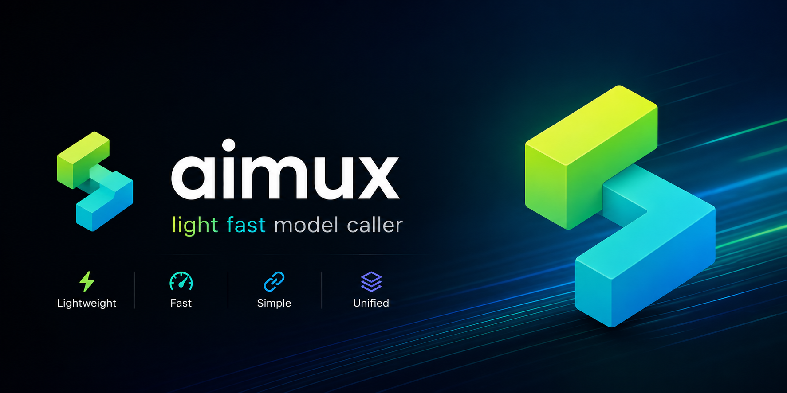

# aimux

<p align="center">
  
</p>

> **A unified LLM access layer written in Rust. One API for 325 AI providers.**

[](https://github.com/arcships/aimux/actions/workflows/ci.yml)
[](LICENSE)
[](https://www.rust-lang.org/)
[](docs/api/providers.md)
[](bindings/)
[](https://crates.io/crates/aimux-core)
[](https://www.npmjs.com/package/@arcships/aimux)
[](https://pypi.org/project/arcships-aimux/)
[](https://pkg.go.dev/github.com/arcships/aimux/bindings/go)
[](https://github.com/arcships/aimux/releases)
[](https://central.sonatype.com/artifact/io.aimux/aimux-java)

aimux is a Rust implementation of a unified LLM provider access layer. It
collapses the HTTP APIs of every AI provider into a single
`dyn LanguageModel` interface that anything upstream can call.

Unlike **rig** or **langchain**, aimux does **not** build agent loops, RAG, or
orchestration — it focuses exclusively on unifying service access. That is the
difference: aimux is an access layer, those are orchestration layers.

---

## Why aimux

- **325 provider modules** — 250 registry-backed OpenAI-compatible
  (unified `provider(name, ...)` entry) + 10 native protocol
  implementations (OpenAI, Anthropic, Google, Bedrock, Vertex, Azure, Cohere,
  Mistral, xAI, Anthropic-AWS) + 65 standalone/modality/local/search providers
  (OpenRouter, DeepSeek, Ollama, vLLM, ElevenLabs, KlingAI, Tavily, …).
  Full list: [docs/api/providers.md](docs/api/providers.md).
- **Unified, object-safe interface** — the `LanguageModel` trait supports
  `Box<dyn>` so providers are interchangeable without changing call sites.
- **Full multimodal** — text, streaming, tool calling, embeddings, image,
  speech, transcription, video, reranking, files.
- **Config-driven provider registry** — `provider-registry.json` describes
  each of the 250 OpenAI-compatible providers (base URL, env var, profile
  quirks: top_k, tools, response_format, streaming usage, max_tokens key);
  one unified `provider(name, ...)` entry in every binding.
- **Fast and small** — Rust core, release profile tuned for binary size
  (`lto`, `codegen-units=1`, `panic="abort"`, `strip`, `opt-level="z"`).
- **8 language bindings** from one core: Node, Python, Swift, Kotlin, Flutter,
  Go, Java, C.
- **Hermetic tests** — 2,650+ cassettes replay real API responses; no network
  or API keys required.

## Performance

Benchmarked against the official OpenAI SDKs on the same machine, same mock
server, same abstraction layer (HTTP + JSON, no orchestration). Full results
and methodology in [docs/PERF-RESULTS.md](docs/PERF-RESULTS.md).

| | aimux | OpenAI SDK | aimux faster |
|---|---|---|---|
| **Node.js** (single req) | 0.101 ms | 1.488 ms | **14.7×** |
| **Python** (single req) | 0.080 ms | 0.595 ms | **7.5×** |

### Sustained stress (2000 requests, 200 KB context, 50 KB response)

| | aimux rps | SDK rps | aimux P99 | SDK P99 | RSS growth |
|---|---|---|---|---|---|
| **Node.js** (32 cores) | 1512 | 563¹ | 1.92 ms | 3.96 ms | +23 MB vs +103 MB |
| **Python** | 1393 | 987 | 0.94 ms | 1.37 ms | **+0 MB** vs +8 MB |

¹ vs Vercel AI SDK (not apples-to-apples — AISDK adds Zod validation,
middleware, and telemetry per request).

### Why it's fast

- **Rust core** — `reqwest` connection pool, no GC, no runtime pauses.
- **Zero memory growth** — Python aimux RSS did not grow a single byte across
  2000 requests; Node grew only 2 MB.
- **Stable tail latency** — no GC pauses means P99 stays flat even under CPU
  contention; the JS SDK's P99 spikes to 12.87 ms on a single core.
- **FFI boundary is cheap** — serialization is ~50% of overhead only on large
  payloads; in real LLM requests (3–10 s) it is <0.1%.

## Architecture

```
aimux/
├── aimux-core            # Core abstractions: LanguageModel / Provider / Message / StreamPart
├── aimux-providers       # 290+ provider implementations (250 registry-backed + native)
├── aimux-stream          # SSE / NDJSON stream parsing
├── aimux-provider-utils  # HTTP utilities: retry, backoff, error parsing, API-key loading
└── aimux-ffi             # C ABI (opaque handle + JSON + push callback) for non-native bindings
```

```
           ┌─ native path ──→ aimux-core + aimux-providers (direct Rust types + async)
bindings ──┤
           └─ C ABI path  ──→ aimux-ffi (opaque handle + JSON + push callback)
```

## Installation

**Rust** (the core library):

```bash
cargo add aimux-core aimux-providers
```

| Crate | Description | crates.io |
|-------|-------------|-----------|
| `aimux-core` | Core abstractions: `LanguageModel` / `Provider` / `Message` / `StreamPart` | [crates.io](https://crates.io/crates/aimux-core) |
| `aimux-providers` | 325 provider implementations | [crates.io](https://crates.io/crates/aimux-providers) |
| `aimux-stream` | SSE / NDJSON stream parsing | [crates.io](https://crates.io/crates/aimux-stream) |
| `aimux-provider-utils` | HTTP utilities: retry, backoff, error parsing | [crates.io](https://crates.io/crates/aimux-provider-utils) |
| `aimux-ffi` | C ABI for non-native bindings | [crates.io](https://crates.io/crates/aimux-ffi) |

**Node.js**:

```bash
npm install @arcships/aimux
```

```typescript
import { openai, generateText } from '@arcships/aimux'

const model = await openai(process.env.OPENAI_API_KEY!, 'gpt-4o')
const result = await generateText(model, 'Explain Rust ownership in one sentence.')
console.log(result.text)
```

> The package ships a typed wrapper (`generateText` / `streamText`) on top of
> the raw napi API. Need the raw JSON-string interface? Use
> `import { openai } from '@arcships/aimux/raw'`.

## Quick start

```rust
use aimux_core::prelude::*;
use aimux_providers::{OpenAIConfig, OpenAIProvider};

#[tokio::main]
async fn main() -> Result<(), AiMuxError> {
    let provider = OpenAIProvider::new(
        OpenAIConfig::new(std::env::var("OPENAI_API_KEY")?)
    );
    let model = provider.model("gpt-4o");

    let result = generate_text(
        &model,
        "Explain Rust ownership in one sentence.",
        GenerateTextOptions::default(),
    ).await?;

    println!("{}", result.text);
    Ok(())
}
```

## Streaming

```rust
use futures::StreamExt;

let result = stream_text(
    &model,
    "Write a haiku about Rust.",
    GenerateTextOptions::default(),
).await?;

let mut stream = result.stream;
while let Some(part) = stream.next().await {
    match part? {
        StreamPart::TextDelta { delta, .. } => print!("{}", delta),
        StreamPart::Finish { .. } => println!("\n[done]"),
        _ => {}
    }
}
```

## Switch providers

```rust
// OpenAI → DeepSeek: only the provider name changes (registry-backed;
// key read from the provider's env var)
use aimux_providers::{provider, provider_from_env, ProviderName};

// 推荐:类型化 ProviderName(IDE 补全 + 编译期检查)
let model = provider(ProviderName::Deepseek, None, "deepseek-chat", None)?;
// 字符串形式同样可用:
let model = provider_from_env("deepseek", "deepseek-chat", None)?;
// model usage is identical — it's all dyn LanguageModel
```

All 250 OpenAI-compatible providers are registry-backed: `provider(name, ...)`
in every binding, with typed `ProviderName` (enum/union/consts per language).
The retired per-provider shell types (`XxxConfig`/`XxxProvider`) are gone —
see [docs/API.md](docs/API.md#providers).

> **Scope:** OpenAI-compatible → `provider(name, ...)`; others (Anthropic,
> multimodal, local…) → their constructors. List:
> [docs/api/providers.md](docs/api/providers.md).

## Provider coverage

| Type | Count | Examples |
|------|:-----:|----------|
| Native protocol | 10 | OpenAI, Anthropic, Google, Bedrock, Vertex, Azure, Cohere, Mistral, xAI, Anthropic-AWS |
| OpenAI-compatible (registry) | 250 | Groq, Fireworks, Together, Perplexity, Ollama Cloud, DeepSeek, Alibaba Tongyi, Zhipu, Baidu, Tencent, Moonshot, SiliconFlow… |
| OpenAI-compatible (standalone + Vertex-hosted) | 32 | OpenRouter, Hugging Face, Ollama, vLLM, SGLang, Llama.cpp, LiteLLM Proxy, Vertex-hosted DeepSeek/Qwen/Llama… |
| Speech / transcription | 10 | ElevenLabs, Deepgram, AssemblyAI, AWS Polly, Cartesia, Hume, Gladia, RevAI, LMNT, Fal |
| Image / video | 8 | Black Forest Labs, Replicate, Luma, Prodia, KlingAI, Recraft, Stability, RunwayML |
| Embeddings / rerank / search | 13 | Voyage, Jina, Tavily, Exa, Firecrawl, Serper, SearXNG, You.com… |
| Other (Responses API, Bedrock/Mantle) | 2 | generic Responses API wrapper, Bedrock Mantle |

Full list: [rfc/0004-provider-inventory.md](rfc/0004-provider-inventory.md).

## Language bindings

aimux ships 8 bindings that share the same Rust core:

| Binding | Path | Tool | Get it | Native library |
|---------|------|------|--------|---------------|
| **Node.js** | native | napi-rs v3 | `npm install @arcships/aimux` — [npm](https://www.npmjs.com/package/@arcships/aimux) | bundled in the package, nothing to do |
| **Python** | native | PyO3 + maturin | `pip install arcships-aimux` — [PyPI](https://pypi.org/project/arcships-aimux/) | bundled in the wheel, nothing to do |
| **Go** | C ABI | cgo (static link) | `go get github.com/arcships/aimux/bindings/go` then `go generate` | auto-downloaded `.a` from [GitHub Releases](https://github.com/arcships/aimux/releases) |
| **Swift** | C ABI | SPM | SPM: `https://github.com/arcships/aimux` (`from: "0.2.0"`) | `libaimux_ffi.dylib` — see [guide](docs/api/swift.md#install) |
| **Kotlin** | C ABI | JNA | `io.aimux:aimux-kotlin` — Maven Central (publishing) | `libaimux_ffi.so/.dylib` or `aimux_ffi.dll` on the JNA search path — see [guide](docs/api/kotlin.md#install) |
| **Java** | C ABI | JNA | `io.aimux:aimux-java` — Maven Central (publishing) | same as Kotlin — see [guide](docs/api/java.md#install) |
| **Flutter** | C ABI | dart:ffi | pub.dev (pending) | platform library, see [guide](docs/api/flutter.md#install) |
| **C / C++** | C ABI | direct link | `.so`/`.dylib`/`.dll` + `aimux-ffi.h` from [GitHub Releases](https://github.com/arcships/aimux/releases) | link against it — see [guide](docs/api/c.md#install) |

See [bindings/README.md](bindings/README.md) and the [API docs](docs/API.md).

## Testing

```bash
cargo test -p aimux-providers --tests
```

Tests run on cassette playback — no network and no keys. See
[rfc/0003-test-cassette.md](rfc/0003-test-cassette.md).

## Documentation

| Doc | Contents |
|-----|----------|
| [docs/API.md](docs/API.md) | **API overview** — shared reference + links to per-language guides |
| [docs/api/reference.md](docs/api/reference.md) | **API reference** — public types & functions lookup |
| [docs/api/providers.md](docs/api/providers.md) | **Provider list** — all 325 providers with entry points (generated) |
| [docs/api/](docs/api/) | **Per-language API guides** — Node.js, Python, Rust, Go, C/C++, Swift, Kotlin, Flutter |
| [docs/PROJECT-OVERVIEW.md](docs/PROJECT-OVERVIEW.md) | Project overview, design decisions, benchmarks |
| [docs/PERF-RESULTS.md](docs/PERF-RESULTS.md) | Performance benchmark results |
| [docs/aimux-vs-aisdk-node.md](docs/aimux-vs-aisdk-node.md) | Node.js DX comparison vs Vercel AI SDK |
| [docs/README.md](docs/README.md) | Documentation index |

### Design docs (RFCs)

| RFC | Contents |
|-----|----------|
| [0001](rfc/0001-multilang-bindings.md) | Multi-language bindings (Node/Swift/Kotlin/Flutter/Python) |
| [0002](rfc/0002-provider-improvements.md) | Config descriptor & thin-wrapper improvements |
| [0003](rfc/0003-test-cassette.md) | Test cassette scheme |
| [0004](rfc/0004-provider-inventory.md) | Full provider inventory & implementation status |
| [0005](rfc/0005-protocol-conversion.md) | Protocol conversion & adaptation layer |
| [0006](rfc/0006-provider-development.md) | Provider minimum acceptance, core contract, tests |
| [0007](rfc/0007-search-model-trait.md) | Search model trait |
| [0008](rfc/0008-multimodal-bindings.md) | Multimodal bindings design |
| [0009](rfc/0009-request-resilience.md) | Request resilience (shared client / jitter / timeout) |
| [0010](rfc/0010-perf-benchmark-vs-aisdk.md) | Performance vs Vercel AI SDK benchmark |
| [0011](rfc/0011-golang-bindings.md) | Go bindings (cgo static link + push callback → channel) |
| [0012](rfc/0012-source-dedup.md) | Source dedup (product source −25%) |
| [0013](rfc/0013-java-bindings.md) | Java bindings (JNA + raw/typed two-layer API) |
| [0016](rfc/0016-align-with-aisdk.md) | Align with Vercel AI SDK (capability gaps) |
| [0017](rfc/0017-provider-config-dx.md) | Unified provider config & request body overrides (DX) |
| [0018](rfc/0018-codex-subscription.md) | Codex subscription channel provider (evaluation) |
| [0019](rfc/0019-session-affinity.md) | Session affinity lightweight support |

## Contributing

Contributions are welcome! Read [CONTRIBUTING.md](CONTRIBUTING.md) for the
development setup, testing workflow, provider/binding conventions, and the pull
request process. Please follow the [Code of Conduct](CODE_OF_CONDUCT.md).

## License

[MIT](LICENSE)
