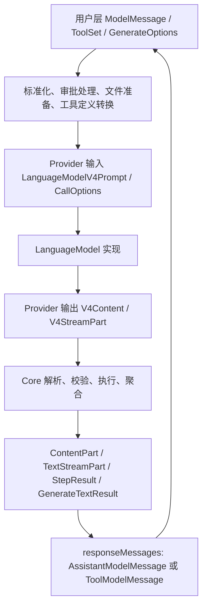

# 全链路对齐 Vercel AI SDK:provider → model、调用运行时、消息协议

> **性质**: [RFC-0036](../rfc/0036-positioning-and-layered-architecture.md)(定位与分层架构)之下的实施设计文档,不是独立 RFC,不占 RFC 编号。随本文件合入生效;§0.4 的四项决定、§0.7 对 ROADMAP 既有承诺的保留 / 调整 / 后置清单,以本文件为准,后续变更直接修改本文件并在 CHANGELOG 记录
>
> **Date**: 2026-09-29
>
> **Reference baseline**: `reference/aisdk-review/node_modules`(本地安装、带 `src/`):`ai` 7.0.122、`@ai-sdk/provider` 4.0.19、`@ai-sdk/provider-utils` 5.0.51、openai 4.0.80、anthropic 4.0.68、google 4.0.85、google-vertex 5.0.98、amazon-bedrock 5.0.100、azure 4.0.84、xai 5.0.12、mistral 4.0.54、cohere 4.0.52、deepseek 3.0.56、groq 4.0.52、openai-compatible 3.0.59、gateway 4.0.100。这是调研与正文 file:line 证据对应的版本;实现用于行为对照的协议 fixture 由随实现提交入库的 `fixtures/aisdk/VERSIONS.json` 单独锁定,可晚于此处,升级时以该文件为准
>
> **Scope**: provider 创建与设置求值、model 获取与解析(registry / 默认 provider)、传输(fetch/WS)、调用运行时(retry / timeout / telemetry / scope)、消息协议(用户输入 / provider 输入 / provider 输出 / core 输出四层)、recording / replay / trace / session / catalogue、组合模型、FFI 与 8 个绑定、CLI / Web 工具
>
> **立场**: 直接替换对象模型与调用链路。**不考虑 breaking change**:不提供旧 API 转发、旧配置归一化、旧录制读取、数据迁移表或 deprecated 别名。
>
> **Supersedes**: 早期仅对齐 provider 工厂外观的草案(本文件的前身);[RFC-0008](../rfc/0008-multimodal-bindings.md)「Alternative: Unified Provider Object」的 Decision;`docs/internal/handoff/HANDOFF.md` §11
>
> **Amends**: [ROADMAP](../ROADMAP.md) 与 [RFC-0036](../rfc/0036-positioning-and-layered-architecture.md) 中与一次性切换、L2 选型相关的承诺(逐项见 §0.7,旧文档中对应段落已加注指向本文);[RFC-0031](ai-sdk-request-pipeline.md)(provider 默认 retry、composite 零重试、helper 录制等有意差异被撤销或改写,见第一部分 §9.4)、[RFC-0017](../rfc/0017-provider-config-dx.md)(通用 body override 路线撤销)、[RFC-0020](../rfc/0020-external-provider-config.md)(全局 overlay 撤销)、[RFC-0023](../rfc/0023-runtime-request-recording.md)(录制 schema 3)、[RFC-0027](../rfc/0027-model-catalogue-and-list-api.md)(one-shot 工厂承诺撤销)
>
> **Appendix**: [aisdk-architecture-impact-map.md](aisdk-architecture-impact-map.md) —— 全仓库 12 模块、201 条经对抗核验的发现与跨模块耦合链路

---

## 0. 前言

### 0.1 为什么是全链路

最初的草案只对齐 provider 工厂(`createXxx(settings)` 两级工厂)。结果下游处处冒出兼容补丁:录制 / 回放需要迁移表、身份需要四套字段、默认 API 切换需要前置条件、retry 无处安放。根因是**架构只对齐了一半**:

- aimux 的 model 持有**公开的配置数据**(`OpenAIConfig` 含 key、base URL、profile、retry、body overrides),下游(recording 的 `config_snapshot → ProviderRecord → rebuild_provider`、TraceLayer scope、catalogue 别名)读取这份数据推导凭证、身份与重建方式;
- 缺少可替换的传输边界(没有 fetch),录制只能写死在 HTTP primitive 里;
- 调用职责(retry、session、recording context)混进了模型协议(`retry_config()`、`CallOptions`);
- **消息协议在 core 内部重复定义**:同一概念有 3–5 份类型(ToolCall ×5、ToolResult ×4、Reasoning / Source / File 各 3–4),字段缺失(`tool::ToolResult` 无 `tool_name`、`ReasoningPart` 只有 `text`)、同一字段跨层语义漂移(`ToolCall.input` 时而原文 String 时而解析值)、wire 形态三套并存(内部标签 / 外部标签 / camelCase 混 snake_case),并经 ts-rs 与 6 套手写镜像扩散到 8 个绑定;
- "身份"是 4 个互不对应的命名空间(`Provider::name()`、`model.provider()`、用户输入名、catalogue id),Web mock、TraceFilter、verdict、replay 已经实际失配。

AI SDK 的做法:provider 把 settings 编译成闭包(`url()`、`headers()`(可异步、每次请求求值)、`fetch`)交给 model;model 只公开 `provider` / `modelId` / `supportedUrls` / `doGenerate` / `doStream`;retry 只在 `ai` 调用层;鉴权全部在 headers 闭包或 fetch 装饰器里(Bedrock SigV4、Azure token 都是 fetch 装饰器);消息协议分层且每层一套类型。本文整体采用这套结构,只列 Rust / C ABI / 多语言绑定强制的适配和 aimux 主动的产品差异。

### 0.2 产生过程

本文经过以下研讨,所有中间产物的结论都已回到本地源码核实(file:line 证据保留在正文中):

1. 4 份独立架构方案(忠实移植 / 以 transport 为脊柱 / 从 FFI 倒推 / 从可观测性倒推),每份 3 维对抗评审(AI SDK 忠实度 / aimux 事实 / Rust 与 FFI 可行性);
2. Codex 独立整体架构方案(不同模型家族);
3. 综合稿 + 3 维核验(完整性 / 事实 / 一致性与可实施性)+ 逐条回源码裁定后修订(第一部分末尾附驳回的核验意见);
4. 全仓库 12 模块扫描 + 逐模块对抗核验 → 影响面地图(附录);
5. core 消息协议 9 概念盘点 + high 缺陷抽查核验 → 统一分层消息协议设计(第二部分)。

### 0.3 全局分层总览

```text
aimux-provider         V4 规范:Provider / 各模态 Model trait、V4 prompt / content / stream part、错误、middleware 规范
  ↑                    (对应 @ai-sdk/provider;无运行时依赖,即第二部分所说的"协议叶子 crate")
aimux-provider-utils   Fetch / WS / Resolvable / load_* / headers / 单次 HTTP helper / 下载守卫 / 传输诊断 / ModelMessage 用户层类型
  ↑  ← aimux-stream    (对应 @ai-sdk/provider-utils;aimux-stream 保持独立的 SSE 解析库)
aimux-providers        create_xxx 工厂、私有 model config、协议转换、鉴权组合、preset(生成)、catalogue 摄取
aimux                  用户操作、resolve / registry / custom / wrap、prompt 标准化与下载、retry / timeout、telemetry、operation scope、组合模型
aimux-devtools         recording(订阅事件 + 传输诊断)、replay_fetch / replay_web_socket、trace middleware、缓存审计、session store
FFI / Node / Python / 5 个 C-ABI 绑定 / CLI / Web   由 descriptor + manifest 单一生成链驱动
```

消息协议四层(第二部分):**用户输入** `ModelMessage`(按 role 分,放 provider-utils)→ `standardize_prompt` / `convert_to_language_model_prompt` → **provider 输入** `LanguageModelV4Prompt`(放 aimux-provider)→ model → **provider 输出** `LanguageModelV4Content` / `LanguageModelV4StreamPart`(tool-call `input` 为原文 String)→ `parse_tool_call` / `convert_language_model_content` → **core 输出** `ContentPart` / `TextStreamPart` / `StepResult` / `responseMessages`(放 aimux)。wire 统一为 AI SDK JSON 形态:camelCase 字段、kebab-case `type` 标签、base64 字节。

### 0.4 跨文档决定记录

两部分文档内部的决策记录在各自的"设计决策记录"中。以下四项跨越两部分或影响产品承诺,在此集中记录结论;各项的"推荐"是形成结论时的论证,保留以便追溯。

**Q1 core 是否引入多 step 引擎、工具执行与审批 —— 决定:不引入**

- 第一部分 D25 主张**保持单步 core**:不引入 agent loop、`prepareStep`、宿主工具自动执行;沿用 RFC-0016 §7.5 "agent loop 不做"与 RFC-0035 的宿主侧修复。
- 第二部分按 AI SDK 完整建模 `ToolSet`(含 execute / 审批 callback)、`StepResult` / `steps` 聚合、审批状态转换,并指出"只补类型壳不算对齐"。
- **推荐**:消息协议**类型按 AI SDK 完整对齐**(`StepResult`、`steps`、tool-approval、tool-error、`tool-output-denied` 等 variant 与 wire 全部就位,确保协议与绑定一次定型);**运行时本期保持单步**(`steps` 恒为 1 项,不执行宿主工具,审批 variant 仅透传 provider 执行工具的审批)。**决定**:第一部分 D25 成立,不引入多步引擎、宿主工具执行与审批运行时;第二部分中涉及这些运行时行为的转换规则(工具执行、审批状态转换、多步聚合)不在本文范围内。这在 §5 产品差异中明确登记为"尚未对齐的行为",不宣称已对齐。

**Q2 字符串模型的默认 provider —— 决定:本地 registry,不走 Vercel Gateway**(aimux 不是 Vercel 生态项目)

- AI SDK 默认回退到 Vercel AI Gateway(`openai/gpt-5` 整串交给 gateway)。
- **推荐(第一部分 D16 已采用)**:`aimux` 不内建默认 provider、不隐式请求 Gateway;`aimux_providers::default_providers()` 返回本地注册条目,绑定与工具在初始化时组装成 registry(`:` 分隔)。登记为产品差异。

**Q3 一次性原子切换 —— 决定:一次性做完**

- 第一部分 §9 把实施定为 P0 准备 → **P1 在集成分支上一次性切换完整依赖闭包**(拆 crate、全部 provider、运行时、录制回放、消息协议、FFI、8 个绑定、3 个工具)→ P2 验收后合入主线;不做纵向切片、不留过渡转发层。
- 这是"不考虑 breaking + workspace 必须全绿"两个约束的直接推论(FFI 与工具在同一 workspace,提前删符号即编译失败)。代价是集成分支存续期长、主线同期冻结相关改动。**推荐**:接受。对 ROADMAP 既有承诺(旧 ABI 共存一个 minor、L2 独立版本化等)的影响见 §0.7。

**Q4 宿主回调 —— 决定:全部语言本期不做,后续单独立项**

- 第一部分 D18:C ABI 保持同步,只注入 Rust 内建能力句柄(fetch / WS / 认证 resolver / middleware);Go / Java / Kotlin / Swift / Flutter 本期不能注入宿主自定义 fetch / model / telemetry。Node / Python 直连 Rust,技术上可以通过 TSFN / GIL 回调注入,但按下面的决定一并后置。
- **推荐**:接受;异步 C ABI(versioned vtable + completion)另立 RFC。
- **决定**:本文定位为**清理与对齐,不新增 feature**。宿主回调(自定义 fetch / model / token / telemetry 跨语言注入)属于新 feature,与 RFC-0035 否决 #186(函数指针回调)、#191(有状态会话)时的考量相同,整体后置。据此,第一部分 §6.4 中 Node(TSFN)与 Python(GIL 回调)的宿主 fetch / model / telemetry 桥接也一并后置;本期各绑定只使用 Rust 内建能力句柄。

**范围原则**:凡是 aimux 现在不具备、需要新增对外能力的项目(宿主回调、多步引擎、工具执行、审批运行时、Evaluation / Realtime / SpeechTranslation / Batch 等),均不在本文范围;本文只做结构清理、行为对齐与已发现缺陷的修复。

### 0.5 两部分之间的衔接约定

- 第二部分提出的"无运行时依赖的 `aimux-protocol` crate"即第一部分的 `aimux-provider`(V4 类型)加 `aimux-provider-utils` 中的用户层 `ModelMessage`,按 AI SDK 的包归属放置,不再另建第三个 crate。
- 第二部分的 JSON 适配规则(base64 字节、ISO 时间、缺失属性省略、JSON null 保留、结构化错误)采纳;第一部分 §6.5 的 descriptor + manifest 生成链是唯一生成来源,ts-rs 与 `scripts/gen_*` 退役(第二部分"ts-rs 可继续"的建议不采纳)。
- 第二部分对 `ProviderOptions`(工厂配置)与 `providerOptions`(消息)同名异义的处理,落在第一部分 §3.3:工厂配置改名为各包 `XxxProviderSettings`。
- 第二部分 §与 provider→model 重构的衔接 中"遵循显示身份、options namespace、catalogue、重建身份分离"一句,以第一部分 §7 的三类信息(模型身份 / 可寻址引用 / 元数据来源)为准;不存在"重建身份"。

### 0.6 独立于本文的事项

- **安全**:aimux-web 绑定非 loopback 地址时,请求可用 `env:任意变量` + 自带 `base_url` 把服务进程的密钥发往任意主机(附录 tl:TOOLS-1,已核实)。已单独立任务修复,不等待本文。
- **真实 bug**:附录 §5 列出 53 条,标注了"重构后自然消除 / 需独立修复"。其中 SSE 1 MiB 单事件上限(as:STREAM-1)、Bedrock converse-stream 非真流式与吞 exception(as:STREAM-2)、Bedrock/Vertex embedding 只嵌入第一个值(ce:BUG-1)、Python 阻塞调用持有 GIL(bd:BIND-4)不依赖重构,建议先行修复。

### 0.7 与 ROADMAP / RFC-0036 既有承诺的关系

[ROADMAP](../ROADMAP.md)(#197)与 [RFC-0036](../rfc/0036-positioning-and-layered-architecture.md)(#198)先于本文合入。本文不重写路线图,只对其中与本设计冲突或被本设计吸收的承诺逐项定性;下表之外的 ROADMAP 条目不受影响。旧文档中被调整的段落已加注指向本节,以免两份互相矛盾的要求同时有效。

维护者同期提出的一批专题 RFC 草案(#206 RFC-0033 registry 维护、#207 RFC-0036 §12–§14 增补、#208 RFC-0038 体积/性能、#209 RFC-0039 ops/绑定、#210 RFC-0040 provider/auth/L0、#211 RFC-0041 replay/治理、#212 RFC-0042 V4 类型/生成)以本文的结构为目标、承接其后的实施验收;本节与 #207 §12.2 的"明确替代清单"逐行对应,二者合入后互相回链。专题 RFC 中标注为"待接受"的新增提案(如 RFC-0040 的 G2/G3、RFC-0042 的 T1–T5)不属于本文的决定。

| ROADMAP / RFC-0036 承诺 | 定性 | 说明 |
|---|---|---|
| RFC-0036 §0 六条原则(性能体积门禁、行为统一、治理一等、数据真相下沉、harness 解耦、不做 agent) | 保留 | 本文是原则 2 / 4 在 provider → model → core 链路上的实施设计 |
| L2 是"版本化投影",选型(AI SDK 形态 / Open Responses / 自有)另立调研 RFC(RFC-0036 §3;ROADMAP 0.7) | 调整 | 选型由本文第二部分定为 **AI SDK V4 形态**,调研 RFC 撤销。"投影不下的进 `provider_metadata` / `Raw`,不得静默丢弃"保留(第二部分 provider namespace 规则)。"不随 1.0 冻结"保留:V4 类型跟随头部锁定的上游基线演进,升级基线即 L2 的版本变更 |
| 0.6 版本语义"binding wire 与 C ABI 不变";0.8 C1 "旧导出保留共存(#166 要求共存至少一个 minor 版本)";1.0 C4 删除旧导出 | 调整 | 本文的切换(§9.1 P1)是一次 **breaking 发布**:对象模型、wire、C ABI 同时替换,不提供旧导出共存、deprecated 别名或转发层(D31、§5"不采用")。发布为一个 0.x minor,CHANGELOG 给迁移说明。此后 ops 协议(见下一行)引入时的旧符号同样按切换门一次替换,不再承诺"共存一个 minor"(与 #207 §12.2 的 C2 / C4 行一致;切换门由 RFC-0039 定义) |
| ops 协议(op 表 / 错误信封 / 二进制帧 / 版本协商)、stdio CLI 入口(RFC-0036 §4;ROADMAP 0.6 schema、0.8 C1) | 保留,后置到本文切换之后 | 本文 §6 替换的是现有 123 个 `extern "C"` 的句柄对象模型与错误传输;`dispatch(op, handle, json)` 应建立在 §6.1 的句柄种类与 §6.5 的 manifest 之上,因此排在 P1 之后。本文不设计 ops 协议 |
| L0 native passthrough(RFC-0036 §3 原则 4;ROADMAP 0.6) | 保留,后置到本文切换之后 | 落点是 §3.2 的 `Fetch` / `WsConnector` 注入与 leaf 诊断:passthrough 复用同一传输边界即可获得 auth / 重试 / 录制。本文不实现它 |
| B 轨 protocol registry = L1 协议层(RFC-0032,B1 "protocol 列 + `from_resolved`",B2–B8 "17 个 LanguageModel → ~7 个协议、33 个 wrapper 退役") | 保留方向,形式调整 | "协议"对应本文 §3.3 / §4.1 的模型实现家族(OpenAI chat / Responses、Anthropic Messages、Google、compat 等);251 个 registry preset 由 descriptor 生成独立厂商工厂并复用 compat 实现(D12、D20),wrapper 退役由此完成。RFC-0032 的 registry 列保留为 descriptor 的数据来源;`from_resolved` 式构造由 `create_xxx` 工厂替代;C2 "FFI 构造器转发 shim"不再需要(§6 一次切换) |
| #174 Auth L1(registry `auth` schema + `apply_auth()`)、#175 Auth L2(Credential 解析序 + CredentialStore + TokenRefresher) | 调整 | 鉴权按 D11 在各厂商包内以 headers 闭包 / fetch 装饰器 / Rust 内建 credential resolver 实现(§3.3、§4.1),registry `auth` 列作为 preset descriptor 数据保留,`apply_auth()` 即生成 headers 闭包。CredentialStore / TokenRefresher 涉及宿主回调与有状态刷新,与 Q4 一并后置;RFC-0018 的无状态刷新边界保留(§4.1 Codex 行) |
| #167 transport-level replay("mock 挂 HTTP 层跑真协议代码";`ProviderRecord` = registry 行 + protocol)、#179 replay 子命令 | 保留,机制按本文 | 即 D4 / D5 的 `replay_fetch` / `replay_web_socket`(§4.3):录制与回放共用 provider-utils 的 leaf 边界,真实 provider 编码器与解析器参与回放。"`ProviderRecord` = registry 行 + protocol"撤销:录制 schema 3 不保存可重建的 ProviderRecord,live replay 由宿主 registry 与 operation 目标引用驱动(D24、§4.4)。#179 子命令保留在 tools |
| #185 "删 `StreamingToolCallTracker`(纯删)→ `ToolInput{Raw,Parsed}`" | 调整 | tracker 不删,改为对齐 `@ai-sdk/provider-utils` 并移入 aimux-provider-utils,由 OpenAI chat 流驱动(#204);`ToolInput` 的 Raw / Parsed 区分由第二部分的四层消息协议承担(V4 tool-call `input` 为原文 String,core 层 `parse_tool_call` 产出解析值) |
| A2–A5 机械清理、E1 内部清理与文档重组、#170 / #171 registry 维护、#180 / #181 小项、S1 / S2 / S3 / P 门禁 | 保留,不受影响 | 与本文无依赖;A2(#203)独立于本文推进 |
| "瘦身不改变对外 API"(ROADMAP §3 / §6.1) | 保留 | 该约束限定体积工作;本文的 API 替换是独立的设计决定,不以瘦身为由 |
| 0.9 治理(漂移检测、能力矩阵、`aimux probe / replay / diff`) | 保留 | 依赖本文 §4.3 的录制 schema 3 与 leaf 诊断,不另行设计 |

**迁移与发布影响**:本文切换合入的那个 minor 版本对 Rust、C ABI、8 个绑定、3 个工具都是 breaking;旧录制(schema ≤ 2)不可读;各绑定的 CHANGELOG 迁移说明随切换一起提交(§9.4)。此后 ROADMAP 的 0.8 / 0.9 / 1.0 内容在新对象模型上实施,不再需要 C2 转发 shim 与 C4 旧导出清理。

---

# 第一部分:provider → model 全链路架构

> 第一部分:修订后的架构稿。
>
> **基线：**仓库当前源码，以及 `reference/aisdk-review/node_modules` 中的 `ai@7.0.122`、`@ai-sdk/provider@4.0.19`。
>
> **立场：**直接替换对象模型与调用链路；不提供旧 API 转发、旧配置归一化、旧录制读取、数据迁移表或 deprecated 别名。
>
> **范围：**provider、model、调用运行时、传输、观测、录制回放、组合模型、catalogue、FFI、八种语言接口及工具。
>
> **证据约定：**`AX:` 相对仓库根；`AI:` 相对上述 `node_modules`。代码块是接口设计，省略辅助类型与实现。
>
> 本次完成源码核验，未修改仓库文件，未运行构建或测试。文中的验收项均为实施要求。

---

## 设计决策记录

| 编号 | 决策 | 依据与约束 |
|---|---|---|
| D1 | 根因定义为配置封装被破坏、缺少可替换传输边界、调用职责与模型协议混合、不同身份被互相代用 | AI SDK 的 config 可以包含数据，也存在模型序列化；不能把“model 没有数据、无法重建”当成设计前提 |
| D2 | 不移植 `WORKFLOW_SERIALIZE`，不以模型配置序列化实现录制或 live replay | aimux 没有 workflow runtime；序列化 helper 会求值 headers，可能包含凭证，并拒绝异步 Promise headers |
| D3 | operation 上下文始终建立；每次模型调用和 attempt 建立 task-local scope | scope 承载 session、父子调用与传输关联，不受 telemetry 开关控制 |
| D4 | 录制订阅调用事件与 provider-utils 传输诊断；协议录制与回放使用同一个 leaf 边界 | helper 外层可能已经看到经过转换的响应，不能把该响应直接回放到转换器内侧 |
| D5 | 录制驱动的 mock 仅由 `replay_fetch`、`replay_web_socket` 实现 | 保留真实 provider 编码器、解析器及协议装饰器；另行规定离线凭证、下载与匹配策略 |
| D6 | 缓存 trace 使用 `LanguageModelMiddleware` | 需要模型调用前后的参数、request 信息、response headers 和流事件 |
| D7 | trace 的实例隔离由宿主提供 scope | 默认 `(provider, model_id)` 仅为便利分组；工具必须提供包含 registry 实例边界的 scope |
| D8 | 审计族来自显式元数据与 descriptor | 不使用 provider 字符串子串判断厂商或审计族 |
| D9 | providerOptions 规则逐模型实现声明 | OpenAI、Anthropic、Google、compat 的规则不同；允许包内按 SDK 规则选择命名空间，禁止全局统一推导 |
| D10 | 设置求值时间逐包对齐 | 区分工厂、取模型、请求三个阶段，不统一成“所有设置都懒加载” |
| D11 | 特殊鉴权维持包内组合 | Azure token、Vertex express、Bedrock 签名使用 fetch 装饰器；Vertex ADC 使用异步凭证能力 |
| D12 | preset 生成独立厂商工厂，复用 compat 内部模型实现 | preset 的 key 懒加载是明确的产品扩展；不以原生 OpenAI model 加 profile 模拟所有厂商 |
| D13 | V4 Provider 与厂商扩展分开 | `chat`、`responses`、`getAvailableModels`、tools 等通过注册条目的扩展能力访问；registry、wrap 不丢失这些能力 |
| D14 | 删除所有 model/provider 默认 retry 配置 | retry 属于操作；router/MoA 为每个 child 配置预算，最终组合失败不得触发整组重跑 |
| D15 | 删除通用 `body_overrides` | compat 保留 SDK 的 providerOptions 透传与 `transformRequestBody`；原生包不增加统一请求体改写契约 |
| D16 | `aimux` 不依赖厂商包、不内建 Gateway | `aimux_providers::default_providers()` 返回注册条目集合；上层调用 `create_provider_registry()` 组装 |
| D17 | 用 crate 依赖强制分层 | 规范、工具、厂商、调用运行时、devtools 分开；`aimux-stream` 保持独立 |
| D18 | C ABI 保持同步；本文不加入宿主控制流回调 | 所有绑定只注入 Rust 内建能力句柄；Node/Python 的 TSFN / GIL 宿主回调桥接与 C 宿主回调一并后置（§0.4 Q4） |
| D19 | 保留单调递增 `u64` ID 与有类型枚举的句柄表 | 当前实现不是代际 slab；扩展种类、错误校验与耗尽处理，不重新发明句柄系统 |
| D20 | descriptor 与 codegen 是唯一生成链 | preset Rust 源码、manifest、绑定与文档提交入库；不使用 `build.rs` 隐式生成另一套产物 |
| D21 | 区分模型身份、registry 引用、包元数据 | `package_id` 不是模型的第四个运行身份，也不靠 endpoint 字符串反解 |
| D22 | 实时转写采用 `TranscriptionModelV4.doStream?` | Rust 用可选流能力表达“没有方法”；不以一次 `UnsupportedFunctionality` 调用结果代替能力发现 |
| D23 | provider-defined tools 是一等能力 | 工厂暴露 tools；独立搜索服务继续使用 aimux 的 Search 扩展 |
| D24 | live replay 由 operation 输入、明确目标引用和宿主 registry 驱动 | 不恢复凭证或模型配置，不猜测第一条子调用就是原 operation 目标 |
| D25 | 保持单步 core | 不引入 agent loop、`prepareStep` 或自动执行宿主工具；保留已有 tool-call repair |
| D26 | 下载守卫保留，下载传输单独注入 | 不把 provider 鉴权栈用于不可信 URL；默认实现继续逐跳校验及 DNS pinning |
| D27 | Telemetry 与 tracing channel 分开 | integration 可按调用替换；recording 不依赖 integration 列表；callback 并发通知，错误不破坏调用 |
| D28 | middleware 规范放在 `aimux-provider` | generate/stream wrapper 同时取得两个执行方向；`override_supported_urls` 支持异步 |
| D29 | 注册条目携带厂商扩展和无凭证元数据 | 解决 registry 下 list models、命名方法、catalogue 与 audit 的可达性 |
| D30 | operation 运行时共享 seq 分配器和 dispatcher | composite 子调用使用统一 helper；并发 child 保持独立 scope 和明确父子关系 |
| D31 | 所有破坏性接口替换按完整依赖闭包一次切换 | 不再承诺“先删核心符号、几期后才改消费方”仍能 workspace 全绿 |

---

## 1. 核心洞察与核验结论

### 1.1 重构对象是职责边界

目标链路为：

```text
settings
  → create_xxx
  → provider
  → 按方法取得 model
  → ai 操作：解析输入、下载、retry、timeout、telemetry
  → model middleware
  → V4 model：协议编码与解码
  → provider-utils helper
  → 协议／鉴权 fetch 装饰器
  → 可观测 leaf
  → 默认传输、宿主 fetch 或 replay_fetch
```

model 可以持有 base URL、闭包、静态字段和厂商协议参数。必须禁止的是下游通过公开 config、`config_snapshot()` 等接口读取配置，再自行推导凭证、实例身份或重建方式。

AI SDK 确实具有模型序列化机制。[serialize-model-options.ts](../reference/aisdk-review/node_modules/@ai-sdk/provider-utils/src/serialize-model-options.ts:26) 会同步解析 headers；这既证明模型可以包含可序列化数据，也说明该机制不适合作为本文的录制格式。

### 1.2 blocker/major 逐条裁定

编号分别对应核验 JSON 中三个 lens 的 defects 顺序：`C` 为完整性，`F` 为事实核验，`I` 为一致性与可实施性。

| 意见 | 裁定 | 源码确认与修订 |
|---|---|---|
| C1：Score/Prefix 丢失 | 成立 | `AX:aimux-core/src/replay.rs:203–374` 有 Score、Prefix，且默认 Score。§4.3 保留两种能力并明确适用范围 |
| C2：mock 在 fetch 前鉴权失败 | 成立 | OpenAI/Groq 在 headers 加载 key；Bedrock 在 fetch 装饰器取得凭证；Vertex ADC 可独立取 token。§4.3 定义离线构造规则 |
| C3：multipart 精确匹配不稳定 | 成立 | `AX:aimux-provider-utils/src/multipart.rs:21` 使用当前纳秒时间构造 boundary。§4.3 按 MIME parts 规范化 |
| C4：配置缺少 env 引用 | 成立 | `AX:aimux-providers/src/provider.rs:437` 支持 env 引用；SDK compat 工厂固定 key。§3.3 新配置支持结构化 secret 引用 |
| C5：registry 丢失 list models 可达性 | 成立 | 现有 FFI 可对其 provider 句柄调用 `list_models`。新注册条目必须保留扩展；§3.4、§6 定义访问路径 |
| C6：catalogue/audit 元数据来源未定义 | 缺口成立 | `AX:aimux-providers/src/catalogue.rs:31` 当前依赖名称映射。§7 改为显式注册元数据；不采用模型身份反查 |
| C7：关闭 telemetry 破坏 affinity | 成立 | 草稿让 scope 随 dispatcher 消失，又让 affinity 从 scope 读 session。§3.5 解耦 |
| C8：SessionInferer 依赖倒置 | 成立 | 当前 session 推断由 generate 入口调用；若接口移入 devtools，将违反目标依赖方向。接口放 `aimux`，实现放 devtools |
| F1：compat 透传展开顺序错误 | 成立 | `AI:@ai-sdk/openai-compatible/src/chat/openai-compatible-chat-language-model.ts:274–322` 中透传位于采样字段之后、消息与工具之前 |
| F2：object tracing 描述错误 | 成立 | SDK tracing 类型没有 object；`generate-object.ts:399` 直接 retry `doGenerate`。§3.5 明确增加 aimux object spans |
| F3：现有句柄表描述错误 | 成立 | `AX:aimux-ffi/src/lib.rs:97–158` 是 `HashMap<u64, HandleEntry>` 加递增 ID，且已有种类校验 |
| F4：body_overrides 覆盖面描述错误 | 成立 | 两条共享实现路径覆盖整个 OpenAI 家族和 Anthropic 家族，不是两个 provider。§4.1 如实登记删除影响 |
| I1：分期与 workspace 全绿冲突 | **blocker 成立** | workspace 包含 FFI 与三个工具；这些消费方仍引用被提前删除的符号。§9 改为完整依赖闭包切换 |
| I2：default_registry 依赖方向冲突 | **blocker 成立** | 草稿同时把 registry 定义在 `aimux`、把创建函数放在禁止依赖 `aimux` 的 providers。改为 `default_providers()` |
| I3：`Arc<Any + Sync>` 无法承载 stream | 成立 | `AX:aimux-core/src/result.rs:234` 的 stream 只要求 `Send`。§3.5 使用可按值取出的 `Box<dyn Any + Send>` |
| I4：audit 表无注入路径 | 成立 | 当前审计实现使用子串分支；新分层没有隐式访问厂商 descriptor 的通路。§3.6 增加显式 resolver |
| I5：会话 registry 无法产生 model_ref | 成立 | 草稿只有全局默认 provider 解析字符串。§3.4 加入显式 registry 引用和命名方法 |
| I6：telemetry 开关影响功能性上下文 | 成立 | 与 C7 同一根因，统一修复 |
| I7：离线回放遗漏鉴权和下载 | 成立 | `AI:ai/src/util/download/download.ts:39` 没有使用 provider 的 fetch。§3.4、§4.3 提供 operation 下载注入 |
| I8：FFI 擦除 registry 和厂商方法 | 成立 | `Arc<dyn Provider>` 无法访问 registry 的固有方法。§6 保留 registry 句柄变体和完整注册条目 |

这些缺陷的核心判断均成立；部分证据表述和建议修复并不成立，文末分别列出。

### 1.3 额外确认：录制和回放必须处于同一边界

[Bedrock-Anthropic fetch](../reference/aisdk-review/node_modules/@ai-sdk/amazon-bedrock/src/anthropic/amazon-bedrock-anthropic-fetch.ts:18) 会转换错误响应，并将 AWS event-stream 转为 SSE。

因此，“helper 录到什么，leaf 就回放什么”不能成立。修订后：

- helper 负责逻辑请求上下文和响应处理。
- leaf 诊断记录协议装饰器内侧的请求和响应。
- replay leaf 返回该边界录得的数据。
- 上层协议转换器在真实请求和回放时各执行一次。

---

## 2. 目标分层

### 2.1 crate 依赖

```text
aimux-provider                         V4 规范、模型类型、错误、AbortSignal
       ↑
aimux-provider-utils ← aimux-stream    helper、传输、设置解析、诊断、注册元数据
       ↑                  独立解析库
aimux-providers                        厂商工厂、模型实现、preset、catalogue 摄取

aimux → aimux-provider / aimux-provider-utils
  调用操作、registry、middleware、retry、telemetry、composite

aimux-devtools → aimux / aimux-provider-utils
  recording、replay、trace、audit、session store

FFI / Node / Python / tools
  组合以上各层；其余语言通过 C ABI
```

约束：

1. `aimux-provider` 不依赖其他 aimux crate，不包含 provider 配置、registry、录制或 retry。
2. `aimux-stream` 不依赖 `aimux-provider`，保留自己的解析错误；provider-utils 在边界转换错误。
3. `aimux-providers` 不依赖 `aimux` 或 devtools。
4. `aimux` 不依赖具体厂商包。
5. devtools 不依赖厂商包；descriptor 和 metadata resolver 由宿主注入。
6. `aimux-core` 的代码按职责拆入上述目标 crate，不留下兼容 re-export。

### 2.2 各层职责

| 层 | 负责 |
|---|---|
| `aimux-provider` | V4 model/provider/middleware 契约，模态参数、结果、stream parts、共享错误 |
| `aimux-provider-utils` | Fetch/WS、headers、Resolvable、load helpers、单次 HTTP helper、下载守卫、传输诊断、无运行时依赖的注册条目与 descriptor 类型 |
| `aimux-providers` | 工厂设置编译、私有 model config、协议转换、鉴权组合、厂商扩展、preset、外部 catalogue 摄取 |
| `aimux` | 用户操作、model resolution、prompt 标准化与下载、retry/timeout、registry/custom/wrap、telemetry、operation scope、组合模型 |
| `aimux-devtools` | 订阅事件形成录制、协议回放、trace middleware、缓存审计、会话聚合 |
| 宿主组装层 | 默认 registry、凭证配置、租户隔离、descriptor 注入、绑定外观、CLI/Web 行为 |

### 2.3 数据归属

| 数据 | 所在位置 |
|---|---|
| `provider`、`model_id` | model 的公开只读身份 |
| URL、key、project、API version、鉴权闭包 | 厂商私有 config |
| `max_retries`、timeout、并发及批处理策略、session | 用户操作选项或 operation 运行时 |
| V4 headers、abort、providerOptions | 从操作转换进入 V4 CallOptions |
| registry key、命名方法、目标引用 | resolution sidecar；不放进 V4 model trait |
| `package_id`、审计族、catalogue 关联 | descriptor 与注册条目元数据 |
| operation ID、seq、attempt、parent | operation runtime 与 task-local scope |
| 请求响应字节、帧、时间 | leaf 诊断事件 |
| 录制、trace、session 历史 | devtools |

---

## 3. 核心接口与执行契约

### 3.1 `aimux-provider`：V4 规范

错误类型继续使用 **`AiMuxError`**，不引入无收益的 `AiError` 改名。

```rust
#[async_trait]
pub trait LanguageModel: Send + Sync {
    fn specification_version(&self) -> SpecificationVersion {
        SpecificationVersion::V4
    }

    fn provider(&self) -> &str;
    fn model_id(&self) -> &str;

    async fn supported_urls(&self)
        -> Result<SupportedUrls, AiMuxError>;

    async fn do_generate(
        &self,
        options: LanguageModelCallOptions,
    ) -> Result<LanguageModelGenerateResult, AiMuxError>;

    async fn do_stream(
        &self,
        options: LanguageModelCallOptions,
    ) -> Result<LanguageModelStreamResult, AiMuxError>;
}
```

`LanguageModelCallOptions` 与本地 V4 对齐，包含 prompt、采样参数、response format、reasoning、tools、tool choice、raw chunks、headers、abort、providerOptions。

不包含：

- retry 或 timeout；
- session、call ID、recording context；
- registry 引用；
- `body_overrides`；
- catalogue 或审计元数据。

其他模态同样拆分用户操作参数与 V4 参数。批大小、并发度、用户超时等不得因复用一个 serde struct 而泄漏给 provider。

```rust
pub trait Provider: Send + Sync {
    fn specification_version(&self) -> SpecificationVersion;

    fn language_model(&self, id: &str)
        -> Result<Arc<dyn LanguageModel>, AiMuxError>;

    fn embedding_model(&self, id: &str)
        -> Result<Arc<dyn EmbeddingModel>, AiMuxError>;

    fn image_model(&self, id: &str)
        -> Result<Arc<dyn ImageModel>, AiMuxError>;

    fn transcription_model(&self, id: &str)
        -> Option<Result<Arc<dyn TranscriptionModel>, AiMuxError>>;

    fn speech_model(&self, id: &str)
        -> Option<Result<Arc<dyn SpeechModel>, AiMuxError>>;

    fn reranking_model(&self, id: &str)
        -> Option<Result<Arc<dyn RerankingModel>, AiMuxError>>;

    fn files(&self) -> Option<Arc<dyn Files>>;
    fn skills(&self) -> Option<Arc<dyn Skills>>;

    // 明确的扩展，不冒充 ProviderV4 成员。
    fn video_model(&self, id: &str)
        -> Option<Result<Arc<dyn VideoModel>, AiMuxError>>;

    fn search_model(&self, id: &str)
        -> Option<Result<Arc<dyn SearchModel>, AiMuxError>>;
}
```

可选方法默认返回 `None`；必选工厂对于不支持的模态返回带正确 `model_type` 的 `NoSuchModel`。不能把凭证、设置错误降格成 `NoSuchModel`。

实时转写区分能力缺失与执行失败：

```rust
fn do_stream<'a>(
    &'a self,
    options: TranscriptionStreamOptions,
) -> Option<BoxFuture<'a, Result<TranscriptionStreamResult, AiMuxError>>> {
    None
}
```

本地 [ProviderV4](../reference/aisdk-review/node_modules/@ai-sdk/provider/src/provider/v4/provider-v4.ts:13) 没有 `evaluationModel`。Evaluation、Realtime、SpeechTranslation、Batch 的具体能力不在本文交付范围；不注册空实现，不宣称已支持。

### 3.2 provider-utils：传输、设置与诊断

```rust
pub struct FetchRequest {
    pub method: Method,
    pub url: Url,
    pub headers: Headers,
    pub body: Bytes,
    pub redirect: RedirectPolicy,
    pub signal: Option<AbortSignal>,
}

pub struct FetchResponse {
    pub status: StatusCode,
    pub headers: Headers,
    pub url: Url,
    pub body: BoxStream<'static, Result<Bytes, FetchError>>,
}

#[async_trait]
pub trait Fetch: Send + Sync + 'static {
    async fn fetch(
        &self,
        request: FetchRequest,
    ) -> Result<FetchResponse, FetchError>;
}

pub type FetchFunction = Arc<dyn Fetch>;
```

关键规则：

- multipart 在 helper 内编码成字节，签名处理最终发送字节。
- 默认 HTTP client 按 Tokio runtime 分片，保留现有连接池生命周期约束。
- `settings.fetch == None` 时，每次请求读取当前默认 leaf；不在工厂创建时冻结全局 fetch。
- WebSocket 使用独立 connector，和默认 HTTP leaf 共用显式 `TransportSettings`。
- 代理与 TLS 设置属于 transport 实例，不保留初始化时机敏感的 `init_proxy`。
- 30 秒非流式 whole-response 上限留在 helper，覆盖注入 fetch 后的完整响应处理；streaming 不套用该上限。
- helper 不执行完整 model operation 的 retry。

设置解析：

```rust
pub enum Resolvable<T> {
    Value(T),
    Fn(Arc<dyn Fn() -> Result<T, AiMuxError> + Send + Sync>),
    AsyncFn(
        Arc<dyn Fn() -> BoxFuture<'static, Result<T, AiMuxError>>
            + Send + Sync>
    ),
    Future(Shared<BoxFuture<'static, Result<T, AiMuxError>>>),
}
```

`Future` 表示一次 Promise 值；`AsyncFn` 表示每次重新求值。两者不能混为一谈。`Shared` 所需的 Clone/Send 约束落实在类型定义和构造器中。

Headers 采用大小写不敏感的覆盖语义：

1. 名称统一小写；
2. 后者覆盖前者；
3. 合并后删除值为 `None` 的字段；
4. 使用覆盖插入，不使用 append 制造重复凭证头；
5. provider headers、调用 headers、auth fetch 的执行顺序逐包对齐。

`load_api_key(Some(s), ...)` 原样返回 `s`，包括空串；仅 `None` 才读取 env。缺失 key 返回 `LoadApiKey`，缺失其他必需设置返回 `LoadSetting`。

**传输观测边界：**

```text
helper：设置逻辑请求范围
  → 协议转换 fetch
  → 鉴权／签名 fetch
  → observed leaf
  → 用户注入 fetch 或默认 HTTP leaf
```

厂商工厂通过 provider-utils 的统一构造器包装 leaf，再组合其协议和鉴权装饰器。下载、catalogue、模型列表也使用相同构造器。不得在 helper 和 leaf 各记录一份、随后把两份当成同一 exchange。

leaf 事件包括：

```text
RequestStarted
ResponseHead
BodyChunk
ExchangeFinished(Completed | Aborted | Failed)
```

请求开始时捕获 scope。响应流持有 exchange guard；EOF、错误、取消、Drop 必须且只能产生一次终结事件。

这记录的是**传给用户 fetch 的边界数据**。用户自定义 fetch 内部若再次改写请求或自行联网，aimux 无法自动观察其内部网络；文档不得把该边界记录宣传为任意自定义 fetch 的物理线上字节。

### 3.3 厂商工厂、默认实例与配置文件

```rust
pub fn create_openai(
    settings: OpenAIProviderSettings,
) -> Result<OpenAIProvider, AiMuxError>;

pub fn openai() -> &'static OpenAIProvider;
```

具体 provider 暴露 `.call()`、`.chat()`、`.responses()` 和实际支持的模态方法。OpenAI 默认 LM 为 Responses；xAI、Hugging Face 按本地源码只提供 Responses LM，不提供 `.chat()`；两者既有的 Chat Completions 实现随切换删除，不保留为 trait 之外的扩展入口（相对 master 的能力变化，记入 CHANGELOG；仍需该端点的调用方用 `create_openai_compatible` 指向对应 base URL）。

config 只对该包及明确的 `internal` 复用接口开放。不得提供公开 config getter。

| 包 | 工厂阶段 | 取模型阶段 | 请求阶段 |
|---|---|---|---|
| OpenAI | 解析、校验 base URL；确定 name | 选择 chat/responses 等实现 | headers 中加载 key |
| Azure | 检查 apiKey/tokenProvider 冲突 | 选择 endpoint 实现 | 按 URL 路径需要解析 resource；token fetch 注入 Authorization |
| Anthropic | base URL 与互斥鉴权检查 | 构造 Messages model | 求值 key/token 与 headers |
| Google | base URL 等工厂设置 | 构造对应模型 | 求值 key |
| Vertex | 解析 express key 等设置 | 构造所需 project/location/base URL，可能失败 | ADC headers 或 express fetch |
| Bedrock | 选择 API key/SigV4 组合 | 构造对应模型 | region、凭证、签名及惰性 URL |
| Groq/DeepSeek 等 | 包内 base URL 规则 | 独立模型实现 | headers 懒加载 key |
| openai-compatible | 固定 apiKey、headers、queryParams | 按 name 构造模型 | 使用固定配置 |
| aimux preset | 固定声明式适配设置 | 构造 compat 内部模型 | 懒加载 key 与必要模板设置 |

默认实例是明确的 Rust 适配：取得默认 provider 本身不 panic、不读取会失败的配置；需要解析时返回正常错误。显式 `create_xxx` 维持该包工厂的错误时机。

C ABI 区分 `aimux_default_provider(package)` 与 `aimux_create_provider(package, settings)`，不得声称二者错误时机完全一致。

**配置文件：**

```json
{
  "providers": {
    "work": {
      "package": "openai-compatible",
      "settings": {
        "name": "work",
        "baseURL": "https://example.invalid/v1",
        "apiKey": { "env": "WORK_API_KEY" }
      }
    }
  }
}
```

`providers_from_config()` 是纯组装函数，不修改全局 registry。

配置层仅在 descriptor 标记的 credential 字段支持结构化 env 引用：

- 先解析引用，再交给正常工厂；
- 对 compat，解析结果在工厂创建时固定；
- 原生 provider 未显式提供 key 时，仍按包规则在请求时读取默认 env；
- 不保留旧的字符串前缀语法；
- 不把 env 来源、解析后的凭证或完整 settings 写入录制。

preset 输入新增 `auth`、能力设置和显式模板参数声明。模板统一采用一种语法，每个参数明确 `setting`、`env` 与校验规则；不能从 `${region}`、`<branch-host>` 等旧文本猜环境变量名。

### 3.4 registry、扩展能力和 model resolution

在 provider-utils 定义中性的注册条目；它不引用 `aimux::ProviderRegistry`：

```rust
pub struct ProviderRegistration {
    pub provider: Arc<dyn Provider>,
    pub extensions: Arc<dyn ProviderExtensions>,
    pub metadata: Option<Arc<dyn ProviderMetadataResolver>>,
}
```

`ProviderExtensions` 是 aimux 的宿主集成能力，包含：

- 命名方法取 model；
- provider tools 构造；
- `getAvailableModels` 等扩展操作；
- 方法和参数的 descriptor。

标准 Provider 不需要实现这些扩展。纯 `Arc<dyn Provider>` 可转换成仅有标准能力的注册条目。

```rust
// aimux-providers：不依赖 aimux
pub fn default_providers()
    -> IndexMap<String, ProviderRegistration>;

pub fn providers_from_config(
    config: ProviderConfigDocument,
) -> Result<IndexMap<String, ProviderRegistration>, AiMuxError>;

// aimux
pub fn create_provider_registry(
    providers: IndexMap<String, ProviderRegistration>,
    options: ProviderRegistryOptions,
) -> ProviderRegistry;

impl ProviderRegistry {
    pub fn provider(
        &self,
        key: &str,
    ) -> Result<ProviderRegistration, AiMuxError>;

    pub fn files(&self, key: &str)
        -> Result<Arc<dyn Files>, AiMuxError>;

    pub fn skills(&self, key: &str)
        -> Result<Arc<dyn Skills>, AiMuxError>;
}
```

registry 默认用 `:` 分隔，在第一个分隔符处分割；model ID 的剩余内容原样传递。命名方法是结构化字段，不靠注册 `openai.chat` 等自动别名反解。

```rust
pub enum LanguageModelRef {
    Id(String),

    Registry {
        registry: Arc<ProviderRegistry>,
        id: String,
        method: Option<String>,
    },

    Model(Arc<dyn LanguageModel>),
}
```

内部 resolution 返回：

```rust
ResolvedModel {
    model,
    reference: Option<RegistryModelReference>,
    metadata: Option<ModelDescriptor>,
}
```

`RegistryModelReference` 保存 registry key、model ID、方法及必要的宿主 registry namespace；不保存 settings。

因此：

- 显式会话 registry 无需修改进程默认 provider；
- `work:gpt-4o + method=chat` 与 `method=responses` 可准确区分；
- 工具生成的录制有完整引用；
- 任意直接传入的模型不会被猜出引用或 package；
- `wrap` 保留已有来源 sidecar；替换模型含义时必须显式重设或清除来源。

完整注册条目的 wrap 同时包装命名方法返回的模型，并保留 discovery、files、tools 与元数据。仅包装 `Arc<dyn Provider>` 时只承诺标准能力。

`custom_provider` 支持标准模态映射、files/skills 和 fallback。自定义命名方法必须显式登记；不能默默穿透到不相关的 fallback 模型。

**下载：**

用户操作提供 `DownloadFunction` 或等价 operation service。默认实现调用受控下载 helper；offline replay 注入同一 ReplaySession 的下载 fetch。

下载发生在 operation scope 内，可以先于 model attempt；其 exchange 以 `phase=prepare` 归属 operation，不伪造一个模型调用序号。

### 3.5 调用运行时、Telemetry 与 scope

```rust
pub struct OperationRuntime {
    pub call_id: Arc<str>,
    pub session_id: Option<Arc<str>>,
    pub dispatcher: Arc<TelemetryDispatcher>,
    pub model_call_seq: AtomicU64,
    pub capture_policy: CapturePolicy,
}

pub struct DiagnosticScope {
    pub call_id: Arc<str>,
    pub session_id: Option<Arc<str>>,
    pub model_call_seq: Option<u64>,
    pub attempt: Option<u32>,
    pub parent: Option<ModelCallAttemptRef>,
    pub step_label: Option<Arc<str>>,
    pub model: Option<ModelInfo>,
    pub model_ref: Option<RegistryModelReference>,
    pub model_metadata: Option<Arc<ModelDescriptor>>,
    pub capture_policy: CapturePolicy,
}
```

OperationRuntime 放在 `aimux`；传输可见的 scope 放在 provider-utils。provider-utils 不持有 dispatcher。

调用顺序：

```text
建立 operation runtime 和 scope
解析显式 session；必要时调用 SessionInferer
解析 model；标准化 prompt；按 supportedUrls 下载
分配本次逻辑 model_call_seq
通知 logical model call start

retry {
    增加 attempt
    建立本次 attempt scope                 始终执行
    开启 attempt tracing span              telemetry 开启时
    组合 executeLanguageModelCall wrappers
    执行 middleware → model
}

通知 logical model call end
完成 operation；流式操作在流终结或取消时完成
```

LM 的 start/end 是逻辑调用事件，retry 内的 attempt spans 与传输事件逐次产生。这与 [generate-text.ts](../reference/aisdk-review/node_modules/ai/src/generate-text/generate-text.ts:1024) 的基本顺序一致。

**关闭观测：**

| 能力 | `telemetry.is_enabled=false` |
|---|---|
| call ID、session、seq、父子关系 | 仍建立 |
| session 推断和 affinity header | 仍执行 |
| retry、timeout、abort、下载 | 仍执行 |
| Telemetry callback、tracing span | 不发布 |
| recorder、session store、依赖该 operation 的 trace | 不采集 |
| 正常错误日志 | 不因此失效 |

`record_inputs=false`、`record_outputs=false` 必须传播到 recorder 和 trace 的捕获策略。不得关闭高层输入记录后，又从 HTTP body 偷录同一输入。

Telemetry 保留当前采用范围的生命周期回调、object callbacks、embed/rerank callbacks、`execute_language_model_call`、`execute_tool`。callback 通过并发 future 集合通知，等待完成并吞掉通知错误；执行 wrapper 的错误仍影响执行结果。

不实现 `onStepFinish` 的 deprecated 转发。Evaluation 若以后纳入范围，必须同时加入模型解析、操作、四个 evaluation callbacks 和 tracing，而不是本期仅列出一个永远不产生的事件。

对象生成明确采用 aimux 扩展：

- `GenerateObject`、`StreamObject` operation span；
- retry 内 `LanguageModelCall` attempt span；
- 对应 scope；
- 现有 object callback 语义。

非 LM 模态增加 `ModelCall { modality }` attempt span。不能把 SDK 的 operation 级 embed span描述为天然的逐 attempt span。

**流结果所有权：**

```rust
pub struct ModelCallOutput(Box<dyn Any + Send>);
pub type OpaqueCall<'a> =
    BoxFuture<'a, Result<ModelCallOutput, AiMuxError>>;
```

仅 ai 层构造、读取和消费该容器。integration 包装执行并透传结果。span 结束时同步发布只读结果视图，随后通过 `Box::downcast` 取回所有权。

stream 本身不要求 `Sync`，也不交给订阅者 clone。`StreamOpened` 表示模型已经返回流；operation 完成仍等待 pump 的终结事件。

内部 spawn 必须同时传播 operation runtime 和 diagnostic scope；返回的 stream、WS session、传输 body 另持有自己的关联与终结 guard，不依赖未来 poll 所在线程的 task-local。

### 3.6 middleware、devtools 与元数据注入

LM middleware 同时取得 `do_generate` 和 `do_stream`。`override_supported_urls` 为异步可选结果，支持模拟流式等跨方向 wrapper。

```rust
pub struct TraceOptions {
    pub store: Arc<dyn TraceStore>,
    pub scope: Option<String>,
    pub audit_family: Option<AuditFamily>,
    pub metadata_resolver: Option<Arc<dyn AuditMetadataResolver>>,
}
```

审计族选择顺序：

1. 显式 `TraceOptions.audit_family`；
2. 当前 resolved model 的包/方法/模型元数据；
3. 注入 descriptor 索引中的唯一精确匹配；
4. `Unknown`。

Unknown 不冒充 OpenAI，不输出需要厂商规则才能成立的结论。

工具与绑定初始化时，用 providers 导出的 descriptors 构造 devtools metadata index，并传给 trace middleware。纯 Rust 用户可以显式注入；不注入也能执行普通 trace，但未知模型没有厂商专用 verdict。

`SessionInferer` trait 和注册接口位于 `aimux`。devtools 只提供前缀推断实现；多租户宿主使用独立 runtime 配置，不以进程全局推断器混合会话。

---

## 4. 子系统设计与必须同步完成的改动

### 4.1 厂商、命名空间与请求体

| 子系统 | 目标行为 |
|---|---|
| 原生 OpenAI、Azure、compat | 分开模型实现；Azure 按 SDK 复用 OpenAI/DeepSeek 的 internal |
| Groq、DeepSeek | 独立模型类；删除共享 OpenAI converter 中全部 Groq 特判 |
| Google/Vertex | Vertex 复用 Google 实现，通过包内 config 控制差异，保留全部内容与 metadata |
| Vertex-Anthropic | 复用 Anthropic 模型；注入 endpoint/body transform、空 supportedUrls、结构化输出和 strict tool 限制 |
| Bedrock | 明确 Converse、Anthropic InvokeModel、Mantle 三条能力；不把 Anthropic-AWS 当作 Bedrock-Anthropic |
| Vertex 子路径 | 包含 anthropic、maas、xai；本地源码存在的子路径不能遗漏 |
| Anthropic-AWS | 保留 Claude Platform on AWS 的独立端点与签名服务名 |
| preset 与本地服务 | 生成工厂和 descriptor；本地服务允许 `auth=none`；不继续使用 `XxxConfig(OpenAIConfig)` 薄包装 |
| Codex | 保留无状态刷新；401 映射 TokenExpired；宿主持久化和刷新后重建 provider |
| 单模态厂商 | 与其他包一样使用工厂、模态方法、helper 和 transport 注入 |

providerOptions 必须描述**查找、合并、回退、回写**，而非仅列出字符串数组：

| 实现 | 本期规则 |
|---|---|
| OpenAI chat | `openai` |
| OpenAI Responses/Azure Responses | 按包内 SDK 规则选择 `openai`/`azure`；保留当前跨包功能性 fallback |
| Anthropic | canonical `anthropic` 与包内首段规则得到的 custom key 合并；custom 优先；按 SDK 记录 custom key 使用情况 |
| Google/Vertex | 包内保留 Vertex 分支；使用 `googleVertex`，保留功能性的 `google` fallback |
| Bedrock | `amazonBedrock`；另外独立读取 `anthropic` 选项，二者不是同一条 fallback 链 |
| compat | `openaiCompatible` 与 name 的规范 camelCase key；优先级及未知字段透传按包定义 |
| aimux preset | 由生成 descriptor 明确命名空间，不通过宿主 registry alias 改变 |

按本文的无兼容立场，SDK 中明确标记为历史兼容的 `vertex`、`bedrock`、`openai-compatible` 等旧键及对应双写/告警转发不移植。该偏差进入 §5，不能声称逐字复制 SDK 所有历史行为。

**compat 请求体顺序：**

```text
model、user
→ 标准采样字段、response_format、stop、seed
→ 当前 provider namespace 的未知字段
→ reasoning_effort、verbosity
→ messages、tools、tool_choice
→ transformRequestBody
```

未知字段可以覆盖它之前的字段，包括采样参数；不能覆盖后面重新赋值的 messages/tools 等字段。

`errorStructure` 是 compat model config 的 internal 能力，不是 `createOpenAICompatible` settings。`metadataExtractor`、`convertUsage` 是独立闭包能力，不能拿一个 mergePatch 宣称全部覆盖。

**删除 body_overrides 的影响：**

现有 OpenAI 家族共享路径覆盖 preset、本地包装及多个原生 provider；Anthropic 路径也被 Anthropic-AWS、Vertex-Anthropic 复用。

删除意味着这些路径原有的通用调用级覆盖都消失。compat/preset 可使用明确的 providerOptions 透传；Anthropic 等原生包没有通用替代入口。

不新增保证适用于所有厂商的 body-patch fetch。将 body 修改放在签名后的 leaf 会使签名失效，并可能导致 `result.request.body` 与发送体不同。厂商需要的 body transform 必须处于明确、可验证的签名前协议位置。

### 4.2 内容、prompt、流与输出适配

以下项与身份和模型实现一起切换：

1. 删除 `Reasoning.signature`、tool call 的独立 `thought_signature` 等重复字段。厂商信息通过 V4 `provider_metadata` / `provider_options` 传递。
2. `response_messages` 不再枚举 Anthropic、Bedrock 等 namespace 提取 signature，而是无损转交内容块的 metadata。
3. 区分输入 prompt 的结构化 tool output 与 provider 返回的 JSON tool result；按各自 V4 类型建模，不保留 `result/output` 历史别名。
4. 保留图片、文件、reasoning、tool call/result、签名、item ID、preliminary/provider-executed 等字段的往返。
5. `openai_output` 不再固定读取 `provider_metadata.openai.logprobs`；输出转换可接收显式 metadata selector，由包 descriptor 或调用方提供。选择不明确时不得猜 namespace。
6. `supported_urls()` 接入 ai 层 prompt 标准化。支持直传的 URL 原样传递，其余经受控下载转换。
7. stream 继续逐 part 转发，不为 trace/replay 预先消费或收集整个流。
8. tool-call repair 继续是现有单步结果处理能力，不引入暂停操作的宿主会话协议。

Router/MoA 默认 `supported_urls={}`，让 ai 层先下载媒体，保证所有候选子模型可消费。不能声称可以简单计算任意正则表达式集合的交集；若以后允许更宽能力，必须是显式、可验证的共同支持策略。

首个 SSE error 的预读保留为已登记的产品差异：

- first-chunk timeout 的现有起算点在文档中明确；
- trace TTFT 从调用 `do_stream` **之前**计时；
- wire 首字节、模型首语义片段、用户首输出分别计时，不混成一个指标。

### 4.3 recording 与 mock replay

**录制 schema 3：**

```text
Recording {
  schema: 3,
  call_id,
  recorded_at,
  operation,
  target: {
    model_ref?,
    model?
  },
  session_id?,
  function_id?,
  capture_policy,

  input: Captured<OperationInputRecord>,

  model_calls: [{
    seq,
    attempt,
    parent?: { seq, attempt },
    step_label?,
    model: { provider, model_id, modality },
    model_ref?,
    package_id?,
    started_at,
    outcome
  }],

  exchanges: [{
    exchange_id,
    phase: prepare | model | auxiliary,
    model_call?: { seq, attempt },
    exchange_index,
    boundary: transport_leaf,
    request: {
      method,
      url_redacted,
      semantic_query,
      headers_redacted,
      body
    },
    response?: {
      status,
      headers_redacted,
      body,
      chunks?
    },
    timing,
    outcome,
    truncated
  }],

  ws_sessions: [...],
  outcome: Captured<OperationOutcome>,
  complete,
  transport_closed,
  replayability: { mock, live, reasons }
}
```

`Captured<T>` 明确区分已采集、被策略禁止和因丢失而缺失。主动关闭输入记录不等于事件丢失。

不保存 provider settings、key 来源或可重建 config。

**完成屏障：**

- operation 已终结；
- 内部 pump、child task、WS 等生产者已关闭；
- 已登记的 exchange/session 均终结；
- 必需控制事件没有丢失。

全部满足才标 `complete=true`。`do_stream` 返回流不能视为 operation 完成。

传输 guard 在异步任务、body 和 WS 生命周期中保活。退出、取消或丢失事件时落为 incomplete。保留 Ring、JSONL、flush、try_flush、stats；高吞吐事件队列溢出必须记 dropped/inconsistent，不能静默生成完整 fixture。

无 scope 的直接 model 调用、catalogue 抓取等默认不进入 operation 录制，只计 orphan 统计。宿主可显式建立辅助 operation scope；不偷偷生成无法关联的录制。

**可回放条件：**

完整录制并不自动可回放。body 截断、仅保留 digest、缺少关键输入、敏感字段不可恢复、未知传输转换、缺少离线构造方案，都必须体现在 `replayability.reasons`。

**离线构造契约：**

ReplaySession 提供 HTTP leaf、WS connector、下载能力、匹配状态与诊断。宿主组装层依据 descriptor 创建离线 provider：

| 鉴权 | 离线处理 |
|---|---|
| 普通 API key | 显式占位 key，避免读取真实 env |
| 无鉴权服务 | 使用 `auth=none` |
| Bedrock SigV4 | 注入静态假 credentials 和显式 region；签名算法正常执行 |
| Azure tokenProvider | 注入固定 token resolver；保留原鉴权模式 |
| Vertex ADC | 使用可注入的固定 token/headers 路径，绕过默认 ADC 获取器 |
| Vertex express | 仅在原目标本来使用 express 时注入占位 key |
| 其他动态认证 | descriptor 提供已验证的离线构造方案；没有方案则报告不可离线构造 |

不得让 auth 装饰器识别“inner 是 replay”后暗中关闭鉴权，也不得为了避开 ADC 将标准 Vertex 请求自动切成 express 请求。

离线组装必须同时替换：

- provider HTTP；
- WebSocket；
- ai 输入下载；
- provider 的输出下载、轮询；
- 可能独立联网的认证获取器。

缺少 fixture 必须返回 replay miss，禁止 fallback 到真实网络。自定义 provider 若绕过这些注入点，不纳入离线保证。

**匹配策略：**

```rust
pub enum ReplayMatcher {
    Exact,
    Sequential,
    Score,
    Prefix,
}
```

匹配先限定 ReplaySession 的目标分区、模态、方法、路由与模型，再比较内容；不依赖 `model.provider()` 与用户输入名相等。

- **Exact：**规范化请求精确匹配，作为协议验收默认值。
- **Sequential：**在已经选定的 scenario 内按 exchange 顺序消费，仍校验方法和路由；用于 poll、下载等状态流程。
- **Score：**对已支持的对话方言抽取 prompt；使用完整消息公共前缀、文本 LCP 和明确的弱评分项。零相关性不命中，平分稳定选择。
- **Prefix：**录制 prompt 必须是当前 prompt 的完整消息前缀，选择最长者。
- Web 的“继续对话”mock 明确使用 Score/Prefix；Node/Python 暴露同一 Rust 实现。
- 非对话模态和未知方言不假装支持 LCP，使用 Exact/Sequential。
- 一次匹配选择整个调用 scenario；retry、poll、WS 帧不各自跨录制随机匹配。

**规范化规则：**

| 内容 | 处理 |
|---|---|
| JSON | 对象键规范化；保留数组顺序、数字、null 与字段缺失的差异 |
| multipart | 解析 MIME；忽略 boundary；以字段名、重复字段顺序、filename、media type、内容摘要比较 |
| 鉴权 headers | 不参与内容匹配；脱敏后记录 |
| URL query | 保留影响语义的参数；敏感签名/token 参数移除或替换为明确占位，不直接删除所有 query |
| 签名时间、签名随机值 | 仅在鉴权位置排除 |
| 模型生成的临时 ID | 优先使用可注入的确定性生成器；必要时按已登记字段建立保持引用关系的符号映射 |
| tool-call ID、previous response ID、业务时间戳 | 默认保留，不按字段名一概删除 |
| 未登记的非确定字段 | Exact miss；不得宽泛删除任意 `id`、`timestamp` |

`Immediate` pacing 只表示不重放 chunk 间等待；不能声称单靠 replay leaf 跳过 ai 层 retry 退避。加速 retry 需要单独注入测试时钟。

### 4.4 live replay

```rust
pub async fn replay_live(
    recording: &Recording,
    target: ReplayLiveTarget,
    options: ReplayLiveOptions,
) -> Result<OperationResult, AiMuxError>;
```

`ReplayLiveTarget` 明确接收宿主 registry 或显式模型目标：

- 从 `recording.target.model_ref` 解析原 operation 的目标；
- 保留命名方法，因此 chat 不会变成 Responses；
- 不使用 `model_calls[0]` 猜目标；
- 直接 model 录制没有引用时，要求调用方指定目标；
- composite 从宿主提供的组合定义解析，不从 child 列表反向恢复完整路由策略；
- 使用新的 call ID，默认创建新的 replay session，保存来源 call ID 供比较；
- 凭证只能来自当前宿主配置；
- operation 输入不完整时拒绝自动 live replay。

dry-run 保留，展示 operation、目标引用、脱敏输入概要及已录 exchange URL；不构造凭证、不请求网络。

### 4.5 retry、组合模型与状态操作

```rust
pub fn prepare_retries(
    max_retries: Option<u32>,
    abort: Option<AbortSignal>,
) -> PreparedRetries;
```

`PreparedRetries::retry<F, Fut, T>()` 保持泛型方法。默认 2 次重试，初始退避 2000ms、倍率 2；保留 Retry-After、jitter、abort 和错误历史。

不再从任何 model、provider settings、配置文件 provider 条目或录制 provider 信息读取 retry 默认值。

| 操作 | 重试边界 |
|---|---|
| text/object/embed/image 等模型操作 | ai 层包住一次模型调用 |
| `getAvailableModels` | 厂商扩展执行一次请求；需要重试时由 ai 层 discovery 操作包装 |
| files upload | 对齐本地 SDK `uploadFile`，不自动重试完整上传 |
| 已提交的异步 job | 仅重试安全的 poll/download 阶段，不重新 submit |
| Codex refresh | 不自动重试旋转 refresh token |
| 已输出语义数据的 stream | 不重试整次生成、不切换备用模型 |

轮询设置通过操作参数或厂商 providerOptions 明确表达。删除 `VideoModel::poll_config()`。provider 内部安全阶段可以有局部、有界策略，但不得依赖 `aimux::retry` 或重新引入 provider 默认 `max_retries`。

Router/MoA 保留 `LanguageModel` 外观，但明确属于 `aimux::composite` 产品扩展：

```rust
pub struct CompositeChild {
    pub model: LanguageModelRef,
    pub max_retries: Option<u32>,
}
```

所有 child 调用经 `composite::child_call()`：

- 取得当前 operation runtime；
- 分配新的逻辑 seq；
- 继承 dispatcher、session、捕获策略和 abort；
- 记录 parent 的 seq 与 attempt；
- 执行 child 自己的 retry；
- 产生 child start/end、attempt spans 和传输关联。

MoA 并发 child 各有 scope；aggregator 重试不重跑已完成 references。组合最终失败包装为不可重试错误，同时保留 child 原始错误及历史。

结果通过 `provider_metadata.aimux.servedBy` 或同等结构记录实际服务模型。MoA 分开保存 references、aggregator 和总用量，不能把累计 usage 冒充 aggregator 的原始用量。

缓存审计挂在 child 模型；组合模型外层可做普通耗时 trace，但不套用某一厂商缓存规则。

### 4.6 catalogue、list models、session、日志与工具

**Catalogue：**

- 保留 capabilities、limits、cost、modalities 等数据。
- 外部数据 ID 到 package 的映射是摄取适配，不是旧 API 别名。
- 未知外部 ID 保留来源信息，不用 `replace('-', '_')` 猜 package。
- join 使用显式 package/model 关联；Azure deployment 等模型 ID 不等于 catalogue ID 时，宿主提供映射，不能自动猜测。
- 抓取通过 helper 与可选 fetch，不自建 reqwest client。

**List models：**

- 注册条目保留 discovery 扩展，registry 子条目、config 构造和 wrap 后均可访问。
- compat/preset 提供明确的 `/models` discovery 实现；本地服务按实际协议登记。
- descriptor 区分 `supported`、`unsupported`、端点/解析器种类。
- 提供方法不等于保证每个远端服务器实现 `/models`；远端 404 正常返回错误，不变成空列表。
- 不将完整 catalogue 塞入 runtime discovery 结果。

**Session：**

- session ID 来自显式参数或可选 inferer。
- affinity middleware 在签名前写 header，与 telemetry 开关无关。
- SessionStore 消费 operation 事件，保存模型身份与目标引用。
- session 推断不得决定凭证、package 或 model resolution。

**日志：**

RFC-0014 的 `tracing` span 保留为统一事件的内建日志适配器。HTTP body 日志订阅传输诊断并执行脱敏，不再在旧 HTTP primitive 中维持另一套录制路径。`aimux_init_logging` 配置该适配器。

**CLI/Web：**

- 由 manifest 驱动 provider、方法、模态、env 和设置表单；删除各端手写 native 列表。
- CLI 使用 `--model key:model` 与 `--method chat|responses|...`。
- Web AgentDef 保存结构化目标引用；不再把 provider/model 字符串兼作连接配置。
- 每个会话使用显式 registry，KeyStore 按宿主 namespace 和 registry key 定位。
- base URL 覆盖创建新的 provider；不得继承原连接的 key、Authorization、token provider 或默认 env 凭证选择。
- 原录制 URL 只能作为展示或编辑提示，不能自动变成带凭证的请求目标。
- mock 使用同一 ReplaySession；不维护按用户输入名构造的 MockReplayModel map。
- 缓存 probe 使用 trace middleware 和显式 registry scope。

### 4.7 影响面地图 §3 的覆盖

下表是本文的交付覆盖，不是旧接口或数据迁移表。

| 影响面编号 | 本文落点 |
|---|---|
| S0-1、S0-4 | §4.5、§5、§9：retry、阶段重试、30 秒上限、peek、body override、Codex 文档同步修订 |
| S0-2、S0-3 | §4.1、§7：逐包身份和命名空间；不采用全局首段派生 |
| S1-1～S1-3 | §3.2：Fetch/WS、签名、headers、空 key、load helpers |
| S1-4 | §3.2、§3.5、§4.3：scope 与统一 leaf 诊断替代侵入式录制 |
| S1-5、S1-6 | §4.5、§4.1：调用级 retry；命名空间 helper 仅在适用的包内复用 |
| S2-1～S2-4 | §3.1、§3.4、§4.3：模型契约、参数拆分、无快照录制、结构化引用 |
| S2-5、S2-6 | §4.2：metadata 往返、typed tool output、supportedUrls 和下载 |
| S2-7、S2-8 | §3.1、§6：Provider、多模态、错误类型与所有消费方 |
| S3-1～S3-3 | §3.5、§4.5、§7：child retry、scope、实际子模型身份、审计位置 |
| S4-1～S4-7 | §3.3、§4.1、§4.5：工厂、原生模型、命名空间、Vertex、内部阶段、默认 Responses |
| S5-1、S5-2 | §4.3、§4.4：新 schema、协议回放、宿主解析目标；旧 schema 和重建路径删除 |
| S6-1 | §3.4：resolve、registry、custom、wrap、default provider |
| S7-1～S7-5 | §6：统一工厂、扩展分发、凭证、transport、错误；C 宿主回调另列范围 |
| S8-1～S8-6 | §6：统一生成链、宿主线程契约、只读身份、wire 类型 |
| S9-1～S9-5 | §4.4、§4.6：工具 registry、KeyStore、回放、base URL 凭证隔离、方法选择 |

---

## 5. Rust 适配与明确的产品差异

| 类别 | 差异 | 决策 |
|---|---|---|
| 语言适配 | 可调用 provider | Rust 使用 `.call()`；支持的绑定恢复调用语法 |
| 语言适配 | 可选方法 | `Option<Result<...>>` 或可选 future，区分能力缺失与执行失败 |
| 语言适配 | 同步/异步设置联合类型 | `Resolvable<T>` |
| 语言适配 | WHATWG Request/Response | Rust FetchRequest/FetchResponse；请求体以 bytes 表达 |
| 语言适配 | AsyncLocalStorage | task-local 加显式 spawn/stream 生命周期传播 |
| 语言适配 | 泛型 telemetry wrapper | `Box<dyn Any + Send>` 擦除结果类型，保留所有权 |
| 语言适配 | 工厂抛异常 | `Result<_, AiMuxError>` |
| 产品选择 | 不可失败的默认 provider 访问 | 延后失败配置的解析；显式工厂仍返回 Result |
| 产品选择 | 默认字符串模型 | 绑定/工具安装本地 registry；不隐式请求 Vercel Gateway |
| 产品选择 | 观测范围 | 为 object 和非 LM 模态增加 operation/attempt 事件 |
| 产品选择 | telemetry 关闭 | 关闭观测，保留功能性 scope 与 session affinity |
| 产品选择 | recording/replay/audit/session | devtools 能力，不进入 model trait |
| 产品选择 | preset 数量与构建 | 单 crate 模块、feature 和提交入库的代码生成 |
| 产品选择 | preset 能力配置 | `max_tokens_key`、`supports_*` 等仅为显式 preset 适配，不冒充 SDK compat settings |
| 产品选择 | preset key | 请求时懒加载；不同于通用 compat 的固定 key |
| 产品选择 | 配置 secret 引用 | 配置解析层支持结构化 env 引用 |
| 产品选择 | discovery/search/composite | aimux 扩展，有独立 descriptor 和测试 |
| 产品选择 | retry 细节 | 保留 jitter、Retry-After 处理和既定错误历史 |
| 产品选择 | helper 超时 | 非流式 30 秒上限，与注入 fetch 无关 |
| 产品选择 | SSE 预读 | 保留首事件错误预读，明确计时影响 |
| 产品选择 | core 工具循环 | 保持单步，不引入 agent loop |
| 不采用 | workflow 模型序列化 | 不用于录制或重建 |
| 不采用 | 历史版本和 deprecated 兼容 | 不实现 V2/V3 适配、旧 namespace 双写、旧方法转发、旧录制读取 |
| 本期范围外 | Evaluation/Realtime/SpeechTranslation/Batch 等完整链路 | 不注册虚假能力；后续需完整接通操作与观测 |
| ABI 范围外 | C 宿主异步 fetch/model/headers/telemetry | 由独立异步 ABI 设计处理；本期提供 Rust 内建句柄 |
| 语言适配 | `specification_version` / `Provider.name()` | `Provider` 与各模型 trait 不带 `specification_version`，`Provider` 不带 `name()`（D-c）：Rust trait 本身就是版本边界，注册名归持有 registry 的一方，身份由模型自己的 `provider()`（`"{name}.{method}"`）承担 |
| 语言适配 | Rust `.call()` 的具体形式 | 每个包的 provider 提供 `call(model_id) -> Arc<dyn LanguageModel>`，与 `Provider::language_model` 返回同一个模型；Rust 无可调用对象，绑定侧在语言允许处恢复调用语法 |
| 产品选择 | OpenAI 默认 `language_model` | 本期保持 chat（`openai.chat`）；上游 `openai(id)` 默认 Responses，对齐延后（S4-7，不在本 PR）。`responses(id)` 显式可用；xAI、Hugging Face、Azure 的默认已是 Responses |
| 产品选择 | Bedrock 上的 Anthropic InvokeModel | aimux 没有 `bedrock.anthropic.messages` 对应的 provider（`anthropic_aws` 是 Claude Platform on AWS，不是 Bedrock InvokeModel）；属新增能力，不在本期 |
| 产品选择 | Azure 未移植的模型 | deepseek、completion、MAI speech 端点和 Foundry item type 未移植 |
| 产品选择 | 视频轮询节奏 | provider 没有 poll 设置；`VideoModel::poll_config()` 保留在 core，作为包内常量的来源，调用级 `VideoCallOptions.poll` 逐字段覆盖 |
| 产品选择 | 录制重建原生协议 provider | `rebuild_provider` 只走 registry 与 overlay；原生协议包返回 `NoSuchProvider`，回放时改用 `replay_with_model` 传入模型 |

本地没有安装源码的厂商包，不能仅凭命名推测宣称“已对齐 AI SDK”。descriptor 记录 `verified_sdk_source` 或 `aimux_extension`；发布前按实际支持承诺完成协议 fixture 验证。

---

## 6. FFI、八种语言接口与代码生成

### 6.1 句柄对象模型

继续使用单调 `u64` ID 加类型枚举：

```rust
enum ProviderHandle {
    Leaf {
        registration: ProviderRegistration,
        source: Option<ProviderSource>,
    },
    Registry(Arc<ProviderRegistry>),
}
```

另有 Model、Files、Fetch、WebSocket、Middleware、TraceStore、Recorder、SessionStore、Operation、Abort 等句柄。

规则：

- registry 句柄不擦除为 `Arc<dyn Provider>` 后丢失自身能力。
- `aimux_registry_provider(registry, key)` 返回保留扩展与 source 的子 provider。
- 从 registry 子 provider 取 model 时，model 句柄保留完整引用和 metadata sidecar。
- wrap 后保留 source 和适用扩展。
- custom provider 没有登记的厂商方法返回明确错误，不猜测或任意转发。
- 传错句柄种类继续使用现有 InvalidHandle 体系。
- ID 分配不得回绕复用；耗尽返回错误。
- drop 维持明确的幂等资源释放契约，带任务的对象负责取消和回收。

### 6.2 核心 C ABI

```c
uint32_t aimux_abi_version(void);

aimux_error_t* aimux_create_provider(
    const char* package,
    const char* settings_json,
    const aimux_setting_handle* handles,
    size_t handles_len,
    uint64_t* out_provider);

aimux_error_t* aimux_default_provider(
    const char* package,
    uint64_t* out_provider);

aimux_error_t* aimux_create_provider_registry(
    const char* entries_json,
    uint64_t* out_registry);

aimux_error_t* aimux_registry_provider(
    uint64_t registry,
    const char* key,
    uint64_t* out_provider);

aimux_error_t* aimux_provider_model(
    uint64_t provider,
    const char* method,
    const char* model_id,
    uint64_t* out_model);

aimux_error_t* aimux_provider_invoke(
    uint64_t provider,
    const char* method,
    const char* args_json,
    char** out_json);
```

`method=NULL` 表示标准默认 language model；其他方法严格来自该注册条目的 descriptor。

registry 获取 files、skills、discovery 的推荐路径统一为：

```text
registry → registry_provider(key) → provider 的能力
```

Rust registry 的便利方法可组合这条路径；无需把 provider ID 偷塞进规范 `Provider::files()`。

操作入口使用 options JSON，加独立的 abort/运行时句柄槽位：

```c
aimux_error_t* aimux_generate_text(
    const char* options_json,
    uint64_t abort,
    char** out_json);

aimux_error_t* aimux_stream_text(
    const char* options_json,
    uint64_t abort,
    aimux_part_cb callback,
    void* context);
```

其他操作保持同一模型引用规则：

- 字符串 ID；
- model 句柄；
- 显式 registry、ID、method 的结构化引用。

序列化对象是 **Wire DTO**，不是运行时 `LanguageModelCallOptions`。转换时校验句柄种类，并解析成 Rust model、AbortSignal、middleware 等对象。闭包和流不参加 JSON 序列化。

### 6.3 目标函数组

| 函数组 | 覆盖 |
|---|---|
| Provider/registry | create、default、config 组装、registry child、custom、wrap、resolve |
| Model | 按方法取模型、只读 model info、wrap |
| 操作 | text、stream、object、embed/many、image、speech、transcribe、rerank、video、search、upload |
| 实时转写 | 创建 Operation、push audio、input done、next part、cancel/drop |
| Transport | 默认 HTTP/WS、设置全局 Rust transport、replay session 的 HTTP/WS/download 能力 |
| Devtools | recorder 生命周期、导出/stats；trace store/middleware/query；session store |
| Discovery/catalogue | provider 扩展调用、catalogue 抓取和查询 |
| 纯数据工具 | OpenAI 输出转换、tool-call repair、Codex refresh |
| 基础设施 | ABI/manifest 查询、日志、abort、错误 getter、handle drop、string free |

`aimux_free_string` 必须保留并写入生成头文件及各绑定所有权契约：

- 返回的 owned string 用它释放；
- stream callback 收到的字符串仅在回调期间有效，需要同步复制；
- borrowed/static manifest 指针与 owned JSON 必须使用不同的明确签名，不能让调用方猜所有权。

新增 LoadApiKey、LoadSetting、NoSuchProvider 等错误时，同步更新：

- C 错误码和结构化 getter；
- Node/Python 错误映射；
- 六种 C 接口消费方；
- Web HTTP 状态映射；
- error golden fixtures。

### 6.4 线程与宿主回调

本期任何绑定都不接受宿主自定义 fetch / model / telemetry / credential callback（§0.4 Q4）。各绑定只能注入 Rust 内建能力句柄；宿主自己管理 token 时，刷新后创建新的 provider。本节只规定执行方式、取消与结果搬运。

**C ABI：**

- 同步运行。
- Rust 内建 fetch、WS、middleware、认证 resolver 通过句柄注入。
- 保留重入保护，并在进入阻塞 runtime 前检查调用环境。
- 现有的 push callback 只负责搬运流事件与结果，不允许同步嵌套模型操作。

内建 credential resolver 可表达 env、静态 token、AWS credentials、ADC 等本地实现的能力。

**Node：**

- 异步入口返回 Promise；流以 JS ReadableStream 暴露，与 Rust stream 之间有取消和背压协议。
- 事件搬运使用受控 TSFN；TSFN 不阻止 worker 退出，环境关闭时注销并取消存量操作。
- 宿主对象仅存于所属 realm 的 runtime context，不注入可能被其他 realm 使用的进程级全局位。
- JS fetch / model / telemetry 桥接本期不提供；后续立项时沿用上述线程契约。

**Python：**

- 所有阻塞运行时入口先释放 GIL（影响面 bd:BIND-4 的修复随本文一起落地）。
- 流迭代器的 `next()` 在释放 GIL 的状态下等待 Rust stream，只在构造 Python 对象时持 GIL。
- EOF、异常、取消均有明确终结和 close 行为。
- Python callable / asyncio awaitable 的桥接本期不提供；后续立项时需明确“不能强行中断一个永不返回的任意 Python callable”这一限制，不伪称 AbortSignal 能终止 Python 代码。

**其余接口：**

| 接口 | 执行方式 |
|---|---|
| Flutter | 后台 isolate 执行同步 C 调用；主 isolate 收结果 |
| Swift | 后台执行器包装同步 C 调用 |
| Kotlin | IO dispatcher 包装 |
| Java | 同步接口及线程池 Future 包装 |
| Go | 同步接口，调用方控制 goroutine |
| C | 同步函数 |

取消通过 Abort 句柄传播；仅取消宿主 Future 而未触发底层 abort，不算完整取消实现。

### 6.5 manifest 与生成链

单一生成链：

```text
规范类型/Wire DTO + 包 descriptor + preset 输入
  → aimux-codegen 生成 preset Rust 源码
  → aimux-manifest 汇总
  → manifest.json
  → 八种语言类型/工厂、FFI 分发、文档、contract vectors
```

descriptor 至少包含：

```text
package_id
factory/default_factory
settings_schema
credential_fields
runtime_handle_fields
methods/default_method
name_semantics
provider_string_rules
provider_options_rules
tools
extensions/discovery
auth/offline_auth_recipe
catalogue_mapping
audit_metadata
supported_features
source_verification
```

manifest 的 `types` 段覆盖 Recording、操作输入/结果、StreamPart、错误、tool 数据、多模态数据；不只覆盖 provider settings。

- ts-rs 和原脚本生成链全部退役。
- `metadataExtractor`、`convertUsage` 等闭包在 C JSON 中不可用；除非另有显式内建实现，未知字段直接报错。
- 不把闭包的 `serde(skip)` 当成“传了但忽略”的合法行为。
- 结构化联合类型使用 discriminator；JSON value、nullable 等基础联合由生成器明确支持。
- 产物提交入库；`--check` 验证一致性；`build.rs` 不生成第二份真相。
- 手写部分限于加载、生命周期、线程/流桥接、错误投影和语言惯用外观，不复制 provider 行为。

---

## 7. 身份、来源与元数据

### 7.1 三类信息严格分开

| 类别 | 内容 | 决定者 |
|---|---|---|
| 模型身份 | `provider`、`model_id`、modality | model 实现 |
| 可寻址引用 | registry namespace、key、method、model ID | 宿主注册与解析 |
| 元数据来源 | package ID、catalogue 关联、audit family、namespace 规则 | descriptor 和显式注册 sidecar |

`package_id` 不进入 V4 model trait。它描述实现/目录来源，不保证账户、端点或实例唯一。

示例：

```text
模型身份：
  provider = azure.responses
  model_id = production-deployment

registry 引用：
  namespace = team-a
  key = work-azure
  method = responses
  model_id = production-deployment

元数据：
  package_id = azure
  catalogue_model_id = 宿主显式配置的模型关联，或 unknown
```

不能根据 `azure.responses` 恢复 resource、租户或 catalogue model。

### 7.2 元数据传播

1. 厂商生成的注册条目携带 descriptor 和方法级 metadata resolver。
2. registry resolution 将元数据放入 ResolvedModel sidecar。
3. operation scope 将其提供给 trace、录制和 catalogue join。
4. wrap 保留或显式替换元数据。
5. 直接传任意 model 时，来源默认为 unknown；调用方可提供显式 annotation。

仅凭固定 provider 字符串生成的精确索引是便利 fallback，无法处理所有自定义 name，也不能覆盖显式来源。

### 7.3 trace scope 与实例隔离

工具的 trace scope 至少包括：

```text
宿主 registry namespace / 实例边界
+ registry key
+ method
+ model_id
```

两个租户都使用 `work`，不得进入同一个缓存历史桶。

纯 Rust 用户未给 scope 时，可退回 `(provider, model_id)`，但接口文档必须说明这不隔离多个 endpoint。未知 audit family 不影响基本 trace，只限制厂商专用分析。

providerOptions 的 namespace 不跟随 registry alias。将 `openai` 注册为 `work`，不会自动让 `providerOptions.work` 成为有效参数。

---

## 8. 删除清单

### 8.1 规范与调用层

删除：

- 各模态 `retry_config()`；
- `VideoModel::poll_config()`；
- `LanguageModel::config_snapshot()`；
- `Provider::name()`、规范上的 `list_models()`；
- `ModelId` 和固定 ProviderName 枚举；
- V4 CallOptions 中的 retry、timeout、session、call ID、recording context、body overrides；
- `CallOptions::for_step()`；
- 独立 signature/thought_signature 冗余字段；
- core 中按厂商 namespace 提取 signature/logprobs 的硬编码；
- `aimux-core` 兼容 re-export；
- deprecated method 和字段别名。

### 8.2 provider-utils 与厂商

删除：

- `ExchangeContext`、`exchange_context_abort_only!`；
- HttpRequest 的录制上下文字段；
- 旧 HTTP primitive 内直接操作 recorder 的代码；
- 公开 `shared_client`、全局 `init_proxy`；
- 显式空 key 回退 env 的行为；
- provider/model config 的公开快照接口；
- `OpenAICompatProfile`、运行时 profile、`Box::leak`；
- 共享 OpenAI converter 的所有 Groq 字符串分支；
- 所有通用 `body_overrides` 和合并函数；
- `OVERLAYS`、运行时名称归一化与融合工厂配置；
- provider 内对 ai 层 retry 的依赖；
- catalogue 的自建 reqwest client；
- 以旧 provider 名重建配置的全部代码。

内部 config 数据本身不删除；改成明确的包内封装。

### 8.3 devtools

删除：

- `ProviderRecord`、`record_provider`、`api_key_source`；
- schema 2 读取与所有旧录制适配；
- `MockReplayModel`；
- 仅按 `choices[0]` 重建结果/流的实现；
- `aimux-providers/src/replay.rs`；
- 依靠 provider 字符串匹配用户输入名的 replay 路径；
- `TraceLayer` 和读取 config 的 scope 构造；
- verdict 子串猜测。

保留 Score/Prefix 的产品能力，按新 ReplaySession 实现；保留 dry-run。

### 8.4 FFI、绑定与工具

删除：

- provider×model×base URL 的融合工厂；
- 旧 provider 注册、初始化代理、模型级 mock replay 入口；
- `Model.trace()` 外观及旧 trace model 句柄；
- 各绑定独立实现的 replay；
- Node 的旧 raw 多模态构造子路径；
- 手写 provider 分发表和重复 wire 类型；
- Web 的字符串 mock map、旧分字段 AgentDef；
- CLI/Web 的 native 名称 match、env/recommendation 手写表；
- 旧生成脚本与多套类型生成来源。

早期仅改变工厂外观的草案被本方案取代。

---

## 9. 实施顺序与验收

### 9.1 集成原则

不采用“先删除核心类型，暂时允许 FFI 和工具失效数期”的方案，也不使用 deprecated 适配层保持编译。

实施分为准备、完整切换、验证三个阶段：

| 阶段 | 内容 | 集成门槛 |
|---|---|---|
| P0：基线与生成准备 | 固定源码基线、建立协议 fixtures、确定目标 schema/descriptor、生成器 PoC、列出完整消费闭包 | 不删除现有运行路径；当前 workspace 保持可构建 |
| P1：原子对象模型切换 | 拆 crate、改全部 model/provider 实现、operation/runtime、录制回放、composite、FFI、八种接口、三个工具及全部必改项 | 整个依赖闭包作为一次可构建切换合入集成分支 |
| P2：协议与生命周期验收 | 完成逐包差分、离线回放、并发、取消、认证、流、生成物检查和文档核对 | 全部发布门槛通过后合入主线 |

P1 可以拆成多个审阅工作包，但这些工作包不被描述为独立可合入、全绿的纵向切片。只有完整替换后的集成结果进入可发布分支。

准备期间主线仍使用当前完整实现；切换后只保留新实现。release/hotfix 从当时已通过完整门槛的主线或发布分支产生，不从半完成集成状态发布。

### 9.2 必须通过的构建检查

- workspace fmt、clippy、test；
- 对规范、工具、厂商 crate 的生产代码限制 panic/unwrap/expect；
- Node、Python 独立 workspace 构建与测试；
- C、Go、Java、Kotlin、Swift、Flutter 的 ABI/contract 冒烟；
- 实际支持平台的 staticlib、动态库及 feature 组合；
- manifest/codegen `--check`；
- 错误码、字符串所有权和句柄种类测试。

不存在“暂时 exclude FFI/tools”的发布门槛。

### 9.3 行为验收矩阵

| 领域 | 必须验证 |
|---|---|
| 工厂 | base URL/name/auth 的求值时间；空 key；缺 key；默认实例与显式工厂 |
| 身份 | OpenAI chat/Responses、Azure、Vertex、嵌套 Anthropic、Groq、xAI；自定义 registry key |
| Headers | 大小写、覆盖、None 删除、无重复凭证、逐 attempt token 更新 |
| 命名空间 | 读取、合并、metadata 回写、下一轮再输入；无旧键转发 |
| 请求体 | compat 透传顺序；原生包工具映射；Responses 默认方法完整可用 |
| Prompt | supportedUrls、受控下载、图片/文件和 tool output |
| 内容往返 | reasoning signature、thought metadata、tool IDs、图片、文件、provider-executed 结果 |
| 流 | 事件顺序、可恢复错误、终结、Drop、pump 取消、TTFT 起算 |
| Retry | 默认 2；Retry-After；仅调用层预算；组合模型不整组重跑 |
| 状态操作 | poll/download 重试不重新 submit；upload 和 refresh 无隐式重跑 |
| 录制 | 全模态、attempt、并发 child、parent、准备阶段下载、WS、barrier、丢失与截断 |
| Mock | 无真实凭证、禁网环境；OpenAI/Anthropic/Google/Vertex/Bedrock；multipart；Score/Prefix；poll/WS |
| Leaf 边界 | Bedrock 原始 event-stream 录制后仅转换一次；错误转换不重复 |
| Live replay | 显式会话 registry、chat/Responses 方法、direct model 缺引用、composite 目标 |
| Trace/session | telemetry 关闭仍有 affinity；自定义 name；两个同名 registry key 的隔离 |
| 扩展 | registry/config/wrap 后 discovery、files、tools 和命名 model 方法仍可达 |
| 绑定 | create→provider→model→info→generate/stream→replay→trace；取消、析构、worker/解释器退出 |
| 工具 | base URL 覆盖不继承凭证；dry-run 不联网；Web mock 不依赖 provider 字符串相等 |

协议差分以同一输入和固定模拟传输分别运行本地 AI SDK 与 aimux，比较 URL、headers、body、标准化结果、stream parts 和错误分类。§5 中主动舍弃的历史兼容行为从对齐断言中明确排除。

删除检查限定在生产代码、公开头文件和生成接口，避免历史文档中的说明造成伪失败。Groq 检查覆盖 `==`、`!=` 以及遗留 namespace 分支，不能只搜一种比较式。

### 9.4 文档必须同时更新

同步改写：

- RFC-0031 / `docs/ai-sdk-request-pipeline.md` 的 provider 默认 retry、composite 默认零重试及 helper 观测描述；
- first-event peek 与各计时指标；
- 30 秒非流式上限；
- provider 内部阶段重试预算；
- RFC-0017 的通用 body override 路线；
- RFC-0018 的无状态刷新边界；
- 多模态参数、错误、providerOptions、默认 Responses；
- 八种接口示例、CLI/Web 使用说明；
- 录制可回放条件与本地 registry 非 Gateway 的说明。

---

## 10. 本稿定案与交付边界

| 原未决问题 | 本稿决定 |
|---|---|
| 宿主回调与异步 C ABI 是否同时重做 | C ABI 维持同步，内建能力用句柄；异步 C 控制流另立设计。Node/Python 的宿主回调桥接与之一并后置（§0.4 Q4），本期各绑定只使用 Rust 内建能力句柄 |
| body_overrides 如何处理 | 全部删除；保留包本身支持的 providerOptions 与 transform，不增加通用签名后 body patch |
| 默认 registry 是否自动安装 | 工具和绑定 runtime 安装本地默认 registry；Rust 用户显式组装；会话调用优先显式 registry |
| live replay 是否保存 settings 提示 | 不保存；使用 operation 目标引用与宿主 registry，直接模型要求显式目标 |
| 多 endpoint 的 trace scope | 宿主提供实例 scope；不从 wire origin 反向恢复模型实例身份 |

交付承诺是：所有现有已支持模态和工具能力接通新的对象模型，影响面地图 §3 的必要改动随切换完成；不以接口占位代替实现，不以 provider 数量代替协议对齐证据。

本期不交付旧版本兼容、旧录制读取、自动恢复配置、任何语言的宿主回调（含 C 宿主异步控制流），以及未纳入范围的新增模态完整运行时。

---

## 附：驳回的核验意见

以下按“驳回范围”裁定；不因修复建议错误而否认其发现的真实缺陷。

| 意见 | 驳回范围及理由 |
|---|---|
| F6：应改成“47 个 model 类实现 WORKFLOW_SERIALIZE” | **数量修正仍不准确。**本地非测试 `src/*.ts` 中，48 个文件引用该符号；排除 `index.ts` 再导出和 `serialize-model-options.ts` 文档示例，实际有 **46** 个 `static [WORKFLOW_SERIALIZE]` 实现声明。正文不再依赖该数量论证 |
| 事实核验未覆盖项：ProviderV4 缺 evaluationModel | **“ProviderV4 成员缺失”不成立。**本地 ProviderV4 无该成员；registry 实现确实通过扩展读取 evaluationModel。可以讨论是否纳入产品范围，不能把它认定为必选 V4 方法遗漏 |
| F3 修复理由：UAF 和 double free 都会变成 InvalidHandle | **对重复 drop 的描述不成立。**现有读取已失效句柄会失败；`drop_handle()` 对不存在 ID 的 remove 是无操作。§6 保留明确的幂等释放，不声称现状会为重复 drop 返回错误 |
| C5：当前能力是“任意 registry provider” | **术语过度。**当前 `aimux_provider_handle_new` 对 registry-backed preset 构造的是 provider 句柄，并非新设计的多 provider registry 对象。不过新稿确实必须补齐 registry 下 discovery 的可达性，缺陷判断接受 |
| C6：catalogue 使用 package ID 与拒绝 endpoint 反解互相矛盾 | **逻辑矛盾判断不成立，来源缺口成立。**包元数据和可寻址身份可以独立存在。采用注册 sidecar 即可，无需新增 provider 字符串反查机制 |
| C2：Vertex mock 可直接改用 express | **不接受通用切换。**express 可能改变 URL、参数及可用模型；本地源码明确拒绝某些 tuned endpoint 与 express 组合。离线应保持原协议路径，注入固定认证能力 |
| I7：auth 装饰器检测 replay leaf 后短路 | **不采用。**这会让正常 provider 鉴权实现依赖测试传输类型。离线组装层显式注入假凭证或固定 resolver，即可保留相同调用链 |
| C3：boundary 由 call_id 派生即可保证回放 | **不足以解决问题。**回放 operation 会产生新 call ID，同一次调用也可能有多个 multipart 请求。采用 MIME 内容规范化，不以 operation ID 作为请求等价依据 |
| I1 方案 A：保留 deprecated 旧符号直到后期删除 | **与用户立场冲突。**不引入过渡转发层，改用完整消费闭包的原子切换 |
| 未覆盖项：补回 onStepFinish 转发 | **不接受历史兼容转发。**只保留 onStepEnd；Evaluation 等能力按完整范围处理，不为消除表面缺项增加空事件 |
| 影响面 S0-2/S0-3：统一 `<optionsName>.<endpoint>` 和首段 namespace | **源码反例足够，不能作为全局规则。**Bedrock 身份不符合该模板，Google/Vertex 与 Responses 有包内分支，Anthropic 有 canonical/custom 合并。保留逐包规则 |
| 影响面 S1-4：必须使用 RecordingFetch 装饰器 | **机制不必照搬。**需要的是可替换传输与同一录制/回放边界；provider-utils 的统一 leaf 诊断满足要求，且不要求用户手工排列录制包装器 |
| 影响面 S4-7：xAI 同时保留 chat/responses | **不符合本地基线。**本地 xAI 工厂只暴露 Responses LM，没有 chat LM 工厂；xAI 与 Hugging Face 既有的 Chat Completions 实现删除，不作为 trait 外扩展保留（§3.3）。OpenAI 的 chat 选择继续提供 |
| 影响面 S5 的旧数据映射、重建和归一化 | **全部排除。**schema 3 仅处理新录制；live replay 依赖宿主目标引用，不保存或重建 ProviderRecord |
| 影响面 S7-3/S8-2：本期必须加入所有语言 credential callback ABI | **需求接受，指定机制不接受。**动态凭证可以由 Rust 内建 resolver 表达；任意 C 宿主回调涉及异步 ABI 和重入契约，不能靠函数指针加 ctx 宣称已经解决 |

上述驳回不减少必须修复的功能缺口；它们限定的是准确的源码结论与可实施的解决方式。

---

# 第二部分:core 消息协议统一设计

建议把消息协议拆成四层：**用户输入、provider 输入、provider 输出、core 输出**。每层只有一套明确契约，跨层通过显式转换连接；相同字段结构复用，语义不同的类型保留边界。当前最严重的问题正是边界消失：同一个工具调用类型既表示原始字符串又表示解析值，同一个内容联合同时承担用户消息和 provider prompt。

本次仅阅读源码，没有修改仓库，也没有运行会生成文件的构建或测试。以下“确认”指静态源码确认；盘点中的 HTTP 400、模型拒绝等远端后果，未经实测的仍标为推断。

核验基线为当前工作区 `badf40cac65e0b9d1fd03b61ef4455431ada188d`，以及本地：

- `@ai-sdk/provider` **4.0.19**
- `@ai-sdk/provider-utils` **5.0.51**
- `ai` **7.0.122**

实施时统一锁定本文头部的源码基线，不能混用不同版本的接口和聚合规则。

为缩短证据路径，本文使用：

| 简写 | 仓库相对路径 |
|---|---|
| `C/` | `aimux-core/src/` |
| `P/` | `aimux-providers/src/` |
| `B/` | `bindings/` |
| `U/` | `reference/aisdk-review/node_modules/@ai-sdk/provider-utils/src/types/` |
| `V4/` | `reference/aisdk-review/node_modules/@ai-sdk/provider/src/language-model/v4/` |
| `S4/` | `reference/aisdk-review/node_modules/@ai-sdk/provider/src/shared/v4/` |
| `A/` | `reference/aisdk-review/node_modules/ai/src/` |

---

**新增概念 `wire-and-options` 的盘点如下。** 它应与现有八个概念并列，覆盖 `definitions / conversions / aisdk_canon / defects / target`，而不是只作为统一命名风格的附录。

`definitions`：当前实际 serde 形态如下。

| 类型族 | 当前序列化形态 | 字段、可选性及字节规则 | 源码 |
|---|---|---|---|
| `Role` | 字符串枚举，如 `"assistant"` | lowercase | `C/message.rs:13` |
| `MessageContent`、`ModelPrompt` | untagged | 分别为字符串或数组 | `C/message.rs:27、80` |
| `ModelMessage` | 普通对象 | `{role,content}`；无消息级 options | `C/message.rs:36` |
| `LanguageModelPromptMessage` | 普通对象 | 所有 role 都是内容数组；`provider_options: None` 输出 `null` | `C/language_model_message.rs:17` |
| 输入 `ContentPart` | internally tagged | `type` 使用 snake_case；字段也为 snake_case；`image/data: Vec<u8>` 输出整数数组 | `C/content.rs:10` |
| 输入 `ContentPart::ToolResult` | 上述联合的分支 | 反序列化接受 `output` 别名，序列化固定写 `result` | `C/content.rs:119` |
| `Tool` | internally tagged | `{"type":"function",...}` 或 `{"type":"provider",...}`；payload 字段为 snake_case | `C/tool.rs:88` |
| `FunctionTool`、`ProviderTool` | 普通对象 | `input_schema/input_examples/provider_options`；`args` 是任意 JSON | `C/tool.rs:13、73` |
| `ToolChoice` | 手写混合形态 | `"auto" \| "none" \| "required" \| {"type":"tool","toolName":...}` | `C/tool.rs:158` |
| `ToolCall`、`ToolResult`、`RawToolCall` | 普通对象，无 `type` | 字段 snake_case；前者 input 为 JSON，Raw input 为字符串 | `C/tool.rs:105、140`；`C/parse_tool_call.rs:26` |
| `GenerateContent` | externally tagged | `{"ToolCall":{...}}`；PascalCase 标签、snake_case 字段 | `C/result.rs:38` |
| `GenerateContent::ToolCall.input` | JSON 字符串 | 但反序列化还接受任意 JSON，并重新 stringify | `C/result.rs:17、60` |
| `StreamPart` | externally tagged | `{"TextDelta":{"id":...,"delta":...}}`；工具 input 为 `Value` | `C/stream_part.rs:15` |
| `FileBytes` | externally tagged | `{"Binary":[1,2]}` 或 `{"Base64":"AQI="}` | `C/shared.rs:58` |
| `FileData` | externally tagged | `{"Data":{"data":...}}`、`Url`、`Reference`、`Text` | `C/shared.rs:70` |
| 三处 Source | 内联在外部标签联合中，或普通对象 | `source_type: String`；没有 document 专属字段 | `C/result.rs:79、145`；`C/stream_part.rs:169` |
| `FinishReason` | 普通对象 | `{unified,raw}`；`unified` 是 kebab-case 字符串；`raw=None` 输出 null | `C/types.rs:8` |
| `Usage`、`TokenUsage` | 普通对象 | snake_case；`total=None` 输出 null，细分计数多数省略 | `C/types.rs:30` |
| `Warning` | externally tagged | `{"Unsupported":{...}}` 等 | `C/types.rs:133` |
| `ResponseFormat` | externally tagged | 单元分支为 `"Text"`；对象分支为 `{"Json":{...}}` | `C/options.rs:17` |
| `ResponseMetadata`、`RequestInfo`、`ResponseInfo` | 普通对象 | snake_case；大量缺值输出 null；timestamp 是无约束字符串 | `C/types.rs:153`；`C/shared.rs:227` |
| `GenerateResult`、`GenerateTextResult`、聚合结果、对象结果 | 普通对象 | snake_case；request/response 结构不统一；大量派生字段独立存储 | `C/result.rs:165、212`；`C/generate.rs:143、195` |
| `CallOptions`、`GenerateTextOptions` | 普通对象 | snake_case；多数可选项输出 null；运行时 signal、callback 等 `serde(skip)` | `C/options.rs:67`；`C/generate.rs:54` |
| `AiMuxError` | 默认外部标签枚举 | 嵌入流、工具调用 error 后继续形成 PascalCase 外层；其内部分支另有命名约定 | `C/error.rs:168` |

这里存在三个不同问题：

1. **判别方式不同**：内部标签、外部标签、untagged、混合字符串/对象同时存在。
2. **同一层协议命名不一致**：`toolName` 与 `tool_name` 同时出现。
3. **可选性不一致**：缺字段、显式 null、空对象、空数组被不同类型和绑定以不同方式处理。

第一项不能通过“所有 enum 都添加 `tag="type"`”解决，因为 AI SDK 本身也不是所有联合都使用 `type`。

`definitions` 中的 provider options/metadata 还存在以下多套表示。

| 位置 | Rust 类型 | 实际允许的非法形态 |
|---|---|---|
| part/message 的 `provider_options` | `Option<Value>` | 数字、字符串、数组，以及错误的 namespace value |
| 调用级、函数工具级 `provider_options` | `Option<HashMap<String, Value>>` | 外层必须对象，但允许 `{"anthropic":42}` |
| `SharedProviderOptions` | `HashMap<String, Value>` | 同上 |
| `ProviderMetadata` | `Value` | 外层甚至不必是对象 |
| `SharedProviderMetadata` | `HashMap<String, Value>` | 与 `ProviderMetadata` 同名概念、不同约束 |
| provider 工厂的 `ProviderOptions` | 配置 struct | 实际是 `base_url/headers/organization/project/max_retries/body_overrides`，与消息 options 完全不同 |

证据：[shared.rs:27](../aimux-core/src/shared.rs:27)、[types.rs:161](../aimux-core/src/types.rs:161)、[provider.rs:122](../aimux-providers/src/provider.rs:122)。

AI SDK 两者均为 `Record<string, JSONObject>`，不是任意 JSON，也不是 `Record<string, JSONValue>`：

- `S4/shared-v4-provider-options.ts:24`
- `S4/shared-v4-provider-metadata.ts:24`
- `U/provider-options.ts:9`

需要统一的是**外层 namespace → 内层 JSON object** 的结构。`ProviderOptions` 与 `ProviderMetadata` 仍应保留不同语义名称，转换时显式表达方向。

`conversions`：当前协议经过以下转换点。

| 转换点 | 当前行为 | 影响 |
|---|---|---|
| 用户消息 → provider prompt | 字符串变 Text，其余 clone；消息 options 固定为 None | role 约束、文件标准化和消息 options 均未正确建立 |
| provider metadata → 回放 options | Text/Reasoning/ToolCall/ToolResult 部分透传；Reasoning 另提取顶层 signature | 同值两处保存，并泄漏 provider 命名空间 |
| provider 流 → core 流 | 原地替换同一个 ToolCall 分支的 input | 类型身份不变，字段语义改变 |
| provider 输出 → 顶层结果 | 投影为简化 ReasoningPart/SourcePart/FilePart | metadata 丢失，文件未进入回放 |
| Rust → Node/Python/FFI | 直接 `serde_json::to_string` 或 `from_str/from_value` | Rust serde 就是实际公共 wire，TS 声明无法改变它 |
| Python 内存对象 ↔ wire | 外部标签先转内部 `type`，序列化时转回外部标签 | 是双向适配，不是另一套公共 wire |
| replay prompt → 用户消息 | 丢弃消息级 options 后重新 generate | 已有 provider prompt 无法忠实重放 |

对应证据：`C/language_model_message.rs:37`、`C/response_messages.rs:124`、`C/generate.rs:1104`、`C/replay.rs:960`、`B/node/src/lib.rs:345`、`aimux-ffi/src/lib.rs:913`、`B/python/python/aimux/wrapper.py:436、613`。

`aisdk_canon`：应采用 AI SDK 的字段和判别标签，同时承认 **AI SDK 的运行时对象类型并不等于一套现成的跨语言 JSON wire 标准**。

- 消息由 `role` 判别。
- 内容、流事件、工具结果输出主要由 kebab-case `type` 判别。
- source 还由 `sourceType` 判别。
- 用户消息 content 可以是字符串或数组；V4 system content 仍是字符串。
- 用户层 ToolChoice 可以是字符串；V4 ToolChoice 全部是对象。
- `URL`、`Uint8Array`、`Date`、`Error`、回调、Promise、Stream 必须明确做语言和传输适配。
- 用户输入文件、V4 输入文件、V4 输出文件、core GeneratedFile 的结构和允许集合不同。

`defects`：新增缺陷建议编号如下。

| ID | 严重度 | 已核实的问题 |
|---|---|---|
| WIRE-1 | high | 输入、provider 输出、core 输出采用三套不一致的标签和字段约定 |
| WIRE-2 | high | options/metadata 多种类型表示，无法保证 namespace → object |
| WIRE-3 | high | Rust provider 非流式工具 input 已改为 String，多语言镜像仍为任意 JSON |
| WIRE-4 | high | 一部分 TS 属性声明必须存在，但 Rust 序列化会省略 |
| WIRE-5 | medium | 字节用 JSON 整数数组；文件同时存在平铺变体、双重外部标签、AI SDK 风格嵌套对象 |
| WIRE-6 | medium | 绑定对必填、缺省、null、默认空值的处理不同 |
| WIRE-7 | medium | Go 部分类型仅提供 RawMessage/any，且 typed Tool 只覆盖 function |
| WIRE-8 | medium | 工厂配置 `ProviderOptions` 与消息协议 `providerOptions` 同名异义 |

`target`：四层分别命名、JSON 字段统一 camelCase、联合按 AI SDK 的实际判别方式编码；统一 options/metadata 基础结构；所有绑定从一个协议源生成；运行时对象不混入 wire DTO。

---

**绑定核验显示，问题不仅是缺字段，还包括字段类型和序列化语义漂移。**

| 绑定 | 已核实的一致部分 | 已核实的偏差或缺口 | 证据 |
|---|---|---|---|
| Node / ts-rs | 准确反映多数 Rust 标签、字段名和 String input | `TokenUsage.no_cache` 等声明必填 nullable，但 serde 会省略；生成类型仍完整继承当前错误分层 | `B/node/src/types/TokenUsage.ts:14`；`C/types.rs:48` |
| Go | ToolCall 的 providerExecuted、dynamic、thoughtSignature、metadata、invalid、error 已有字段 | raw content 为 `json.RawMessage`，消息 content 为 `any`；typed Tool 只有 function；`omitempty` 会改变 Rust 某些空值输出 | `B/go/types.go:105、123、247、314` |
| Java | ContentPart/StreamPart 的主要现有字段已镜像 | provider `GenerateContent.ToolCall.input` 仍是 `JsonNode`；必填字符串/对象常默认空值；ModelMessage 无 options | `B/java/src/main/java/ai/arcships/aimux/Types.java:1577、2317` |
| Kotlin | 现有 ContentPart.ToolCall 已含 providerExecuted，不能再记作缺失 | provider input 仍是 `JsonElement`；`encodeDefaults=false` 与大量默认空值使必填字段可能被省略 | `B/kotlin/src/main/kotlin/ai/arcships/aimux/Types.kt:45、390、804` |
| Swift | 手写编码覆盖当前外部标签与 snake_case | provider input 仍是 `JSONValue`；FunctionTool.providerOptions 也是任意 JSON，弱于 Rust 外层 map | `B/swift/Sources/Aimux/Types.swift:261、763` |
| Flutter | 现有 ToolCall 字段基本覆盖 Rust | provider input 为 dynamic；部分 metadata 强制 Map，但 Rust 允许任意 Value；ModelMessage.content 为 Object | `B/flutter/lib/types.dart:495、1068、1207` |
| Python | 外部标签可双向还原；现有工具调用字段已有镜像 | provider input 为 Any；同一 metadata 概念有 Any、Dict 两种限制；顶层 reasoning/files/sources 是弱类型字典列表 | `B/python/python/aimux/wrapper.py:374、603、933、946` |

共同缺口是：六套手写 `ModelMessage` 都没有消息级 `providerOptions`；同时所有绑定都继承了缺少 reasoning-file、custom、审批相关分支的问题。

`ts-rs` 当前有生成与文件集检查脚本，但其保证范围只到 TS。脚本会启动 Cargo 并写临时导出目录，因此本次没有运行。其实现见 [gen_ts_types.py:37](../scripts/gen_ts_types.py:37)。

需要特别区分两种 TS 情况：

- **真正不一致**：`TokenUsage.no_cache` 的 Rust `None` 被省略，而 TS 要求该属性存在。
- **当前一致但不符合目标风格**：`ReasoningStart.provider_metadata` 在 Rust 中会输出 null，TS 的必填 nullable 声明因此与当前输出一致。

不能把它们统一归因为“ts-rs 不会处理 Option”。

---

**现有八个概念的 high 缺陷，按主张逐项抽查如下。** 表中确认的是对应源码行为，不代表原条目列出的所有 provider 场景都已端到端验证。

| 概念、缺陷 ID | 判定 | 核验结果与证据 |
|---|---|---|
| tool-call：TC-1 | 确认 | `StreamPart::ToolCall.input: Value` 明确承担两种语义；`generate.rs` 再写入解析值。`C/stream_part.rs:82`、`C/generate.rs:1104`。V4 必须为 String：`V4/language-model-v4-tool-call.ts:23` |
| tool-call：TC-2 | 部分确认，子断言证伪 | provider 流含 core 的 invalid/error 确实混层。但 AI SDK 的 DynamicToolCall 也把 invalid/error 定义为独立可选字段，不能声称 SDK 类型保证 `invalid ⇒ error`。`A/generate-text/tool-call.ts:35` |
| tool-result：TR-1 | 确认 | Anthropic 解包 `{type,value}`，OpenAI 则直接 stringify 整个对象，同一输入语义不一致。`P/anthropic/convert.rs:1307`、`P/openai/convert.rs:766` |
| tool-result：TR-2 | Anthropic tool-role 路径确认 | 分支用 `..` 忽略显式 is_error，只识别非规范 `"error"` 信封；不识别 error-text/error-json。`P/anthropic/convert.rs:631、1312`。“所有 provider”范围未全量证明 |
| tool-result：TR-3 | 类型及 Google 路径确认 | tool_name 可选，构造器填 None，Google 回退为 tool_call_id。`C/content.rs:129、176`、`P/google/convert.rs:391`。远端拒绝仍是推断 |
| tool-definition：TOOLDEF-1 | 确认 | examples 为 `Vec<Value>`，Anthropic 用 `get("input").unwrap_or(...)` 猜测。`C/tool.rs:34`、`P/anthropic/prepare_tools.rs:304`；V4 要求 `{input: JSONObject}` |
| tool-definition：TOOLDEF-2 | 确认，但应归类为混层 | 当前 ToolChoice 是正确的用户层形态，却被直接用于 V4 CallOptions。缺的是 `prepare_tool_choice` 和独立 V4 类型。`C/tool.rs:178`；`A/prompt/prepare-tool-choice.ts:4` |
| tool-definition：TOOLDEF-3 | 静态确认 | core 无 ToolChoiceViolation 定义/检查；解析工具后直接收集。`C/generate.rs:659`。SDK 在 generate 和 stream 两条路径检查：`A/generate-text/generate-text.ts:1155`、`stream-language-model-call.ts:644` |
| reasoning：RSN-1 | 确认 | core 从固定 namespace 提升 signature；Google 优先使用该顶层字段。`C/response_messages.rs:31、130`、`P/google/convert.rs:247` |
| reasoning：RSN-2 | 确认 | 顶层 ReasoningPart 只有 text，转换丢 metadata。`C/result.rs:137`、`C/response_messages.rs:127` |
| reasoning：RSN-4 | 确认 | Google 明确把 thought 图片降级为普通 File。`P/google/model.rs:578、827`；core 无对应 reasoning-file 分支 |
| reasoning：RSN-12 | 静态确认 | Vertex-Claude thinking 事件 metadata 为 None；直连 Anthropic 的 signature-only block 在 started=false 时不输出。`P/vertex/anthropic_model.rs:484`、`P/anthropic/stream.rs:1238、1284` |
| reasoning：RSN-13 | 确认，需注明条件 | 没有 previous_response_id 绕过时，每个 reasoning part 单独追加同 id item。`P/openai/responses/convert.rs:158`。SDK 按 reasoningId 合并：`@ai-sdk/openai/src/responses/convert-to-openai-responses-input.ts:1167` |
| file-media：FILE-1 | Google 路径确认 | user 只处理 Image/File，其余跳过；assistant 文件也跳过。`P/google/convert.rs:185、203、353`。原完整 provider 矩阵未逐格核验 |
| file-media：FILE-2 | 数组编码确认，规范表述需收窄 | `Vec<u8>` 无 codec，确实输出整数数组。`C/content.rs:24、32`、`C/shared.rs:62`。但不能把 base64 描述为 SDK 对所有运行时文件的唯一表示 |
| file-media：FILE-3 | aimux 混乱确认；上游子断言证伪 | aimux 存在三类形状。但“AI SDK 全链路只有一种文件形状”不成立，详见下文 |
| file-media：FILE-4 | 确认 | generate/consume 的 File 只进入 files，不调用回放构建器。`C/generate.rs:433、708` |
| file-media：FILE-10 | 确认 | prompt 转换只是 clone；LanguageModel 无 supportedUrls 能力；未建立统一下载/媒体识别流程。`C/language_model_message.rs:52`、`C/language_model.rs:25` |
| source：SRC-1 | 确认 | 三处定义无 mediaType/filename；Google、Cohere 实际发 document source。`C/result.rs:79、145`、`C/stream_part.rs:169`、`P/cohere/model.rs:209` |
| source：SRC-2 | 确认 | 顶层 sources 丢 metadata，Cohere 确实产生 citation metadata。`C/generate.rs:694`、`P/cohere/model.rs:196` |
| message-envelope：MSG-ENV-1 | 确认 | role 与任意 content 独立组合；转换不校验；OpenAI tool-role 丢弃非 ToolResult。`C/message.rs:38`、`C/language_model_message.rs:52`、`P/openai/convert.rs:486` |
| message-envelope：MSG-ENV-2 | 确认 | 用户消息无 options，转换固定 None；replay 也明确丢弃。`C/message.rs:38`、`C/language_model_message.rs:60`、`C/replay.rs:960` |
| message-envelope：MSG-ENV-4 | 静态确认 | split_prompt 仅拆字符串/数组；InvalidPrompt 无构造点。`C/generate.rs:1206`、`C/error.rs:216`。SDK 的非空、system opt-in、schema 校验见 `A/prompt/standardize-prompt.ts:34` |
| message-envelope：MSG-ENV-5 | 确认，与 RSN-1 合并 | 同一 signature 提升和重复存储问题，不应另算独立根因 |
| message-envelope：MSG-ENV-6 | 确认，与 FILE-4/RSN-4 合并 | 文件回放缺失与缺少 custom/reasoning-file 类型共同造成 |
| stream-and-result：SR-1 | 确认，与 TC-1 合并 | 同一原始流与 core 流类型的混层问题 |
| stream-and-result：SR-2 | 确认 | 用户层仍使用 delta、V4 finishReason/usage，无 start-step/finish-step 等层次。`C/stream_part.rs:26、43` |
| stream-and-result：SR-3 | 确认 | 当前 provider content 六类、流十八类，缺少 custom/reasoning-file/tool-approval-request。`C/result.rs:40`、`C/stream_part.rs:17` |
| stream-and-result：SR-4 | 确认，与 SRC-1 合并 | source 三份定义及 document 字段缺失 |
| stream-and-result：SR-5 | 主要确认，需纠正部分解释 | 外部标签、大小写混用和 TokenUsage 声明问题成立；Reasoning metadata 必填 nullable 不是当前 serde/TS 不一致 |

对原盘点需要作以下明确修正：

- **证伪 TC-2 的子断言**：SDK DynamicToolCall 的 `error?: unknown` 不是必填；应区分公开类型允许范围与 core 解析器自身必须维持的状态不变量。
- **证伪 FILE-3 的子断言**：SDK 文件不是全链路单一结构。用户输入接受宽联合；V4 输入是 FileData；V4 输出只允许 data/url；core 输出是 GeneratedFile。
- **修正 SR-5**：Python 的内部标签适配会反向序列化为原外部标签，不能据此认定 Python 另有一套公共 wire。
- **收窄 TR-2**：不能把“tool-role 分支忽略 is_error”扩张为“所有角色都忽略”。Anthropic assistant server-tool-result 路径会读取它，见 `P/anthropic/convert.rs:751、787`。
- **修正 target**：不能要求所有 `ContentPart` 分支都带 providerMetadata。当前 SDK 的 core approval request/response 类型没有该字段。
- **修正 target**：source 不进入 responseMessages 是 SDK 的明确规则，不能把它与文件丢失一起修成“所有输出都回放”。见 `A/generate-text/to-response-messages.ts:30`。

本次没有发现可以整体撤销的 high 根因；被证伪的是以上局部断言和过度概括。

---

**统一协议应保留以下四层，并把 wire 编码作为横切规则。**



这四层应分别落到 `model_message`、`language_model::v4`、`generation` 等命名空间。**现有 `ContentPart` 名称留给 core 输出**，以对应 `ai/src/generate-text/content-part.ts`；用户输入改为按角色限定的 part 联合。

可以共享的包括 JSON 基础类型、provider namespace map、Source payload、Warning、文件数据叶子结构，以及语义完全相同的 text/reasoning payload。不能共用一个“大而全”的 part enum 再靠运行时 role 判断是否合法。

以下 Rust 均为设计草图；省略常规 derive、重复字段属性和实现体，不是可编译补丁。表中的 `?` 表示 JSON 属性可省略。

**基础类型应先解决 namespace、缺失值与二进制编码。**

```rust
pub type JsonValue = serde_json::Value;
pub type JsonObject = serde_json::Map<String, JsonValue>;
pub type NamespaceMap = BTreeMap<String, JsonObject>;
pub type ProviderReference = BTreeMap<String, String>;

#[derive(Serialize, Deserialize)]
#[serde(transparent)]
pub struct ProviderOptions(pub NamespaceMap);

#[derive(Serialize, Deserialize)]
#[serde(transparent)]
pub struct ProviderMetadata(pub NamespaceMap);

// 运行时持有 bytes；JSON 始终编码为 base64 字符串。
#[derive(Serialize, Deserialize)]
#[serde(transparent)]
pub struct Base64Bytes(
    #[serde(with = "base64_bytes")]
    pub Vec<u8>,
);

// 自定义 serde：字段缺失与显式 JSON null 必须能够区分。
pub enum Optional<T> {
    Missing,
    Present(T),
}
```

`Optional<T>` 的要求：

- `Default` 为 Missing。
- 字段使用 `#[serde(default, skip_serializing_if = "Optional::is_missing")]`。
- Present 的反序列化直接调用 `T::deserialize`。
- 对 `Optional<String>`，显式 null 不会被当成正常字符串。
- 对 `Optional<JsonValue>`，显式 null 保留为 `Present(Value::Null)`。

这样可以避免 `Option<Value>` 在反序列化时把“缺字段”和“值为 null”合并。普通运行时 API 可以继续用 Option；wire DTO 必须保留上游 JSONValue 的 null 语义。

生成的 JSON TypeScript DTO 对缺失属性使用 `?`。上游运行时的 `number | undefined` 可在 SDK facade 中恢复，但不能要求 JSON 对象携带不存在的 undefined。

provider options/metadata 的内部键完全透传，不执行 camelCase 改写，不从 `model.provider()` 拆字符串推导 namespace。

**用户输入 `ModelMessage` 应按 role 建模。**

| role | content 类型 | 允许的 part |
|---|---|---|
| system | String | 无 part 数组 |
| user | String 或数组 | text、image、file |
| assistant | String 或数组 | text、custom、file、reasoning、reasoning-file、tool-call、tool-result、tool-approval-request |
| tool | 数组 | tool-result、tool-approval-response |

四种消息都允许消息级 `providerOptions?`。依据是 `U/*-model-message.ts`，尤其 `assistant-model-message.ts:32` 和 `tool-model-message.ts:23`。

```rust
#[derive(Serialize, Deserialize)]
#[serde(
    tag = "role",
    rename_all = "lowercase",
    rename_all_fields = "camelCase"
)]
pub enum ModelMessage {
    System {
        content: String,
        #[serde(default, skip_serializing_if = "Optional::is_missing")]
        provider_options: Optional<ProviderOptions>,
    },
    User {
        content: UserContent,
        #[serde(default, skip_serializing_if = "Optional::is_missing")]
        provider_options: Optional<ProviderOptions>,
    },
    Assistant {
        content: AssistantContent,
        #[serde(default, skip_serializing_if = "Optional::is_missing")]
        provider_options: Optional<ProviderOptions>,
    },
    Tool {
        content: Vec<ModelToolPart>,
        #[serde(default, skip_serializing_if = "Optional::is_missing")]
        provider_options: Optional<ProviderOptions>,
    },
}

#[derive(Serialize, Deserialize)]
#[serde(untagged)]
pub enum UserContent {
    Text(String),
    Parts(Vec<ModelUserPart>),
}

#[derive(Serialize, Deserialize)]
#[serde(untagged)]
pub enum AssistantContent {
    Text(String),
    Parts(Vec<ModelAssistantPart>),
}
```

用户输入叶子类型必须覆盖：

| part | 字段 |
|---|---|
| text | `text: String, providerOptions?` |
| image | `image: DataContent \| URL \| ProviderReference, mediaType?, providerOptions?` |
| file | `data: FileData \| DataContent \| URL \| ProviderReference, mediaType, filename?, providerOptions?` |
| reasoning | `text, providerOptions?` |
| reasoning-file | `data: data/url 文件数据或 DataContent/URL, mediaType, providerOptions?` |
| custom | `kind: NamespacedKind, providerOptions?` |
| tool-call | `toolCallId, toolName, input: JsonValue, providerExecuted?, providerOptions?` |
| tool-result | `toolCallId, toolName, output: ModelToolResultOutput, providerOptions?` |
| tool-approval-request | `approvalId, toolCallId, reason?, isAutomatic?, signature?, inputSchemaInput?` |
| tool-approval-response | `approvalId, approved, reason?, providerExecuted?` |

其中：

- 删除 reasoning 顶层 signature 和 tool-call 顶层 thoughtSignature；相关内容留在 provider namespace 中。
- 审批 request 的 `signature` 是另一个上游定义字段，**不能因删除 reasoning.signature 而一起删除**。
- `toolName` 在输入 ToolResult 中必填。
- 输入 ToolResult 不再携带 provider 输出层的 `isError/preliminary/dynamic`。
- 用户层支持原生 bytes、URL 对象等便利输入；跨 JSON 边界时转换为字符串或上游已有的 tagged FileData 形态。
- `ModelPrompt` 仍可作为字符串/消息数组的 untagged 联合，但 `instructions` 应支持字符串、SystemModelMessage 或其数组；`allowSystemInMessages` 按本地 SDK 默认 false 实现。

**provider 输入 `LanguageModelV4Prompt` 必须独立于用户输入。**

```rust
pub type LanguageModelV4Prompt = Vec<LanguageModelV4Message>;

#[derive(Serialize, Deserialize)]
#[serde(
    tag = "role",
    rename_all = "lowercase",
    rename_all_fields = "camelCase"
)]
pub enum LanguageModelV4Message {
    System {
        content: String,
        provider_options: Optional<ProviderOptions>,
    },
    User {
        content: Vec<V4UserPart>,
        provider_options: Optional<ProviderOptions>,
    },
    Assistant {
        content: Vec<V4AssistantPart>,
        provider_options: Optional<ProviderOptions>,
    },
    Tool {
        content: Vec<V4ToolPart>,
        provider_options: Optional<ProviderOptions>,
    },
}
```

上述每个 Optional 字段均展开为前述 default/skip 属性。各 role 的分支集合为：

| role | V4 part 集合 |
|---|---|
| system | String |
| user | text、file |
| assistant | text、file、custom、reasoning、reasoning-file、tool-call、tool-result |
| tool | tool-result、tool-approval-response |

重要差异：

- Image 在进入 provider 前转换为 File。
- V4 **输入** tool-call 的 input 仍是解析 JSON；String 要求属于 V4 **输出**。
- 用户消息中的 tool-approval-request 由 core 消费，不直接进入 V4 assistant prompt。
- tool-approval-response 仅为 provider 执行工具保留到 V4；宿主工具的审批由 core 处理。依据 `A/prompt/convert-to-language-model-prompt.ts:273、370`。

文件数据用共享叶子结构，并区分允许集合：

```rust
#[derive(Serialize, Deserialize)]
#[serde(rename_all = "camelCase")]
pub struct InlineData {
    pub data: Base64Bytes,
}

#[derive(Serialize, Deserialize)]
#[serde(rename_all = "camelCase")]
pub struct UrlData {
    pub url: Url,
    #[serde(default, skip_serializing_if = "Optional::is_missing")]
    pub original_url: Optional<String>,
}

#[derive(Serialize, Deserialize)]
#[serde(tag = "type", rename_all = "kebab-case")]
pub enum FileData {
    Data(InlineData),
    Url(UrlData),
    Reference { reference: ProviderReference },
    Text { text: String },
}

#[derive(Serialize, Deserialize)]
#[serde(tag = "type", rename_all = "kebab-case")]
pub enum GeneratedFileData {
    Data(InlineData),
    Url(UrlData),
}
```

普通 V4 输入 FilePart 使用完整 `FileData`，并有 `filename?`。V4 reasoning-file 输入，以及 V4 file/reasoning-file 输出，只使用 data/url 子集。现有输出 FileData 允许 reference/text 的范围过宽。

`originalUrl?` 也必须补齐，依据 `S4/shared-v4-file-data.ts:25`。

工具结果输出应成为受判别的联合：

```rust
#[derive(Serialize, Deserialize)]
#[serde(
    tag = "type",
    rename_all = "kebab-case",
    rename_all_fields = "camelCase"
)]
pub enum V4ToolResultOutput {
    Text {
        value: String,
        provider_options: Optional<ProviderOptions>,
    },
    Json {
        value: JsonValue,
        provider_options: Optional<ProviderOptions>,
    },
    ExecutionDenied {
        reason: Optional<String>,
        provider_options: Optional<ProviderOptions>,
    },
    ErrorText {
        value: String,
        provider_options: Optional<ProviderOptions>,
    },
    ErrorJson {
        value: JsonValue,
        provider_options: Optional<ProviderOptions>,
    },
    Content {
        value: Vec<V4ToolResultContent>,
    },
}
```

`V4ToolResultContent` 只有：

- text：`text, providerOptions?`
- file：`data: FileData, mediaType, filename?, providerOptions?`
- custom：`providerOptions?`

最后这个 custom **没有 kind 字段**，不能与消息顶层 CustomPart 合并。

用户层 `ModelToolResultOutput` 的外层结构相同，但 content 数组还包含当前 SDK 声明的 `file-data/file-url/file-id/file-reference/image-data/image-url/image-file-id/image-file-reference`。这些是当前上游输入面的组成部分，应由统一转换函数归一化，不能因为“不保留 aimux 兼容”而误删上游接口。

工具定义分成两套：

| 层 | 模型 |
|---|---|
| 用户层 | `ToolSet = name → ToolDefinition`，包含 function/dynamic/provider，schema、execute、toModelOutput、审批及生命周期 callback、title、metadata、context 等 |
| V4 层 | FunctionTool / ProviderTool 的纯数据联合 |

V4 字段：

```rust
#[derive(Serialize, Deserialize)]
#[serde(rename_all = "camelCase")]
pub struct InputExample {
    pub input: JsonObject,
}

#[derive(Serialize, Deserialize)]
#[serde(
    tag = "type",
    rename_all = "kebab-case",
    rename_all_fields = "camelCase"
)]
pub enum LanguageModelV4Tool {
    Function {
        name: String,
        input_schema: JsonSchema,
        description: Optional<String>,
        input_examples: Optional<Vec<InputExample>>,
        strict: Optional<bool>,
        provider_options: Optional<ProviderOptions>,
    },
    Provider {
        id: NamespacedKind,
        name: String,
        args: JsonObject,
    },
}

#[derive(Serialize, Deserialize)]
#[serde(
    tag = "type",
    rename_all = "kebab-case",
    rename_all_fields = "camelCase"
)]
pub enum LanguageModelV4ToolChoice {
    Auto,
    None,
    Required,
    Tool { tool_name: String },
}
```

用户 ToolChoice 保留字符串/对象混合形态，通过 `prepare_tool_choice` 转为上面的 V4 对象联合。用户运行时 ToolDefinition 不能直接 derive 成 V4Tool，更不能序列化 execute 等回调。

V4 CallOptions 应包含上游的 `prompt/maxOutputTokens/temperature/stopSequences/topP/topK/presencePenalty/frequencyPenalty/responseFormat/seed/tools/toolChoice/includeRawChunks/headers/reasoning/providerOptions`；abortSignal 是运行时句柄。core retry、timeout、recording、session 等放在调用上下文中，避免继续混入 V4 DTO。`responseFormat` 改成 `{type:"text"}` 或 `{type:"json",schema?,name?,description?}`。

**provider 输出采用完整 V4 content 与 stream part。**

```rust
#[derive(Serialize, Deserialize)]
#[serde(rename_all = "camelCase")]
pub struct V4ToolCallPayload {
    pub tool_call_id: String,
    pub tool_name: String,
    pub input: String,
    pub provider_executed: Optional<bool>,
    pub dynamic: Optional<bool>,
    pub provider_metadata: Optional<ProviderMetadata>,
}

#[derive(Serialize, Deserialize)]
#[serde(rename_all = "camelCase")]
pub struct V4ToolResultPayload {
    pub tool_call_id: String,
    pub tool_name: String,
    pub result: NonNullJsonValue,
    pub is_error: Optional<bool>,
    pub preliminary: Optional<bool>,
    pub dynamic: Optional<bool>,
    pub provider_metadata: Optional<ProviderMetadata>,
}

#[derive(Serialize, Deserialize)]
#[serde(
    tag = "sourceType",
    rename_all = "kebab-case",
    rename_all_fields = "camelCase"
)]
pub enum SourcePayload {
    Url {
        id: String,
        url: String,
        title: Optional<String>,
        provider_metadata: Optional<ProviderMetadata>,
    },
    Document {
        id: String,
        media_type: String,
        title: String,
        filename: Optional<String>,
        provider_metadata: Optional<ProviderMetadata>,
    },
}

#[derive(Serialize, Deserialize)]
#[serde(tag = "type", rename_all = "kebab-case")]
pub enum LanguageModelV4Content {
    Text(TextOutputPayload),
    Reasoning(ReasoningOutputPayload),
    Custom(CustomOutputPayload),
    File(V4FilePayload),
    ReasoningFile(V4FilePayload),
    Source(SourcePayload),
    ToolCall(V4ToolCallPayload),
    ToolResult(V4ToolResultPayload),
    ToolApprovalRequest(V4ToolApprovalRequestPayload),
}
```

`SourcePayload` 在 content、stream、独立 Source 输出中复用；独立 Source 包装仍输出 `type:"source"`。不能把 payload 的 `sourceType` 当成完整 Source 对象而漏掉 `type`。

其他 payload 字段如下：

| payload | 字段 |
|---|---|
| Text / Reasoning | `text, providerMetadata?` |
| Custom | `kind, providerMetadata?` |
| File / ReasoningFile | `mediaType, data: GeneratedFileData, providerMetadata?` |
| ToolApprovalRequest | `approvalId, toolCallId, providerMetadata?` |

`LanguageModelV4StreamPart` 完整覆盖 **21 类事件**：

| 事件 | 字段 |
|---|---|
| text-start / text-end | `id, providerMetadata?` |
| text-delta | `id, delta, providerMetadata?` |
| reasoning-start / reasoning-end | `id, providerMetadata?` |
| reasoning-delta | `id, delta, providerMetadata?` |
| tool-input-start | `id, toolName, providerExecuted?, dynamic?, title?, providerMetadata?` |
| tool-input-delta | `id, delta, providerMetadata?` |
| tool-input-end | `id, providerMetadata?` |
| tool-call / tool-result / tool-approval-request | 复用上述 V4 payload |
| custom / file / reasoning-file / source | 复用上述 V4 payload |
| stream-start | `warnings` |
| response-metadata | `id?, timestamp?, modelId?`，flatten 共享 metadata |
| finish | `usage: V4Usage, finishReason: V4FinishReason, providerMetadata?` |
| raw | `rawValue` |
| error | `error` |

所有 enum 使用内部 `type`，标签 kebab-case，payload 字段 camelCase。provider tool-call **不包含** invalid、error、toolMetadata、thoughtSignature。

provider 结果结构为：

```text
LanguageModelV4GenerateResult {
  content: V4Content[],
  finishReason: { unified, raw? },
  usage: V4Usage,
  warnings: Warning[],
  providerMetadata?,
  request?: { body? },
  response?: { id?, timestamp?, modelId?, headers?, body? }
}

LanguageModelV4StreamResult {
  stream: V4StreamPart 流,
  request?: { body? },
  response?: { headers? }
}
```

V4 usage 必须拆成不同输入/输出计数结构：

```text
inputTokens:  { total?, noCache?, cacheRead?, cacheWrite? }
outputTokens: { total?, text?, reasoning? }
raw?: JSONObject
```

未知计数不填零；用户层 usage 通过显式转换得到。不能继续让同一个 TokenUsage 同时允许输入 reasoning 和输出 cacheWrite。

错误应区分：

- 调用建立失败：`do_generate/do_stream` 返回 Err。
- provider 协议内错误：`{type:"error",error:...}`。
- 流读取/传输失败：可由 Rust TryStream 的 Err 表示，等价于 JS ReadableStream 的读取失败。

不应仅根据 SDK 的 `ReadableStream<Part>` 类型就断言“它没有流失败通道”，进而机械删除 Rust 的所有 Err。需要删除的是当前同一错误被不同绑定随意转换为不同通道的行为。

**core 输出必须拥有自己的 `ContentPart` 和 `TextStreamPart`。**

core ToolCall 的 input 是解析后的值；provider raw input String 在解析、校验、repair 之前一直保持原文。

| core 类型 | 字段与约束 |
|---|---|
| StaticToolCall | `toolCallId, toolName, input, providerExecuted?, providerMetadata?, toolMetadata?, title?, dynamic?:false, invalid?:false`；无 error |
| DynamicToolCall | 同上，`dynamic:true, invalid?:bool, error?` |
| TypedToolResult | `toolCallId, toolName, input, output, providerExecuted?, providerMetadata?, toolMetadata?, dynamic, preliminary?, title?` |
| TypedToolError | `toolCallId, toolName, input, error, providerExecuted?, providerMetadata?, toolMetadata?, dynamic, title?` |
| ToolApprovalRequestOutput | `approvalId, toolCall: TypedToolCall, reason?, isAutomatic?, signature?` |
| ToolApprovalResponseOutput | `approvalId, toolCall: TypedToolCall, approved, reason?, providerExecuted?` |
| ToolOutputDenied | `toolCallId, toolName, providerExecuted?, dynamic?:false` |

静态/动态工具调用应在 Rust 内部用不同类型或受验证的联合表示；wire 仍按 SDK 的 `dynamic` 字段编码，不新增 `status` 或额外标签。

core 自己可以用 `ParseOutcome::Invalid { error, ... }` 保证解析失败一定携带错误，但不能把这个内部不变量误称为 SDK DynamicToolCall 的静态类型要求。

provider deferred tool result 可能没有本轮可关联的调用输入，SDK 会设置 `input: undefined`，见 `A/generate-text/convert-language-model-content.ts:87`。wire 必须能表示这种缺失，不能凭空填 `{}` 或 null。

GeneratedFile 使用一个数据来源：

```rust
pub struct GeneratedFile {
    bytes: Arc<[u8]>,
    media_type: String,
    provider_metadata: Optional<ProviderMetadata>,
}

// API：base64()、bytes()/uint8Array()、media_type()。
// wire DTO：{ base64, mediaType, providerMetadata? }。
// 不同时存储可独立修改的 base64 与 byte array。
```

V4 file URL 在进入 core GeneratedFile 前按上游行为下载，见 `A/generate-text/resolve-generated-file-data.ts:14`。普通生成文件与 reasoning 文件分别进入相应输出分支。

core `ContentPart` 为 **11 类**：

```rust
#[derive(Serialize, Deserialize)]
#[serde(tag = "type", rename_all = "kebab-case")]
pub enum ContentPart {
    Text(TextOutputPayload),
    Custom(CustomOutputPayload),
    Reasoning(ReasoningOutputPayload),
    ReasoningFile(GeneratedFileOutputPayload),
    Source(SourcePayload),
    File(GeneratedFileOutputPayload),
    ToolCall(TypedToolCallPayload),
    ToolResult(TypedToolResultPayload),
    ToolError(TypedToolErrorPayload),
    ToolApprovalRequest(ToolApprovalRequestOutputPayload),
    ToolApprovalResponse(ToolApprovalResponseOutputPayload),
}
```

这里的 file payload 是 `{file: GeneratedFile, providerMetadata?}`。`tool-output-denied` 属于 TextStreamPart，不应擅自加入当前 SDK ContentPart。

`TextStreamPart` 完整覆盖上游 **26 类**事件，其中关键差异为：

| 事件 | core 形态 |
|---|---|
| text-delta / reasoning-delta | `id, text, providerMetadata?`，字段是 text |
| tool-input-delta | 仍为 `id, delta, providerMetadata?` |
| tool-input-start | 在 V4 字段上增加 `toolMetadata?` |
| tool-call/result/error | core 解析及执行后的类型 |
| file/reasoning-file | `{file: GeneratedFile, providerMetadata?}` |
| source/custom | 复用对应输出 payload |
| tool-output-denied | 对应上表 |
| tool-approval-request/response | 使用完整 core toolCall 对象 |
| start | 无额外字段 |
| start-step | `request, warnings` |
| finish-step | `response, usage, performance, finishReason, rawFinishReason?, providerMetadata?` |
| finish | `finishReason, rawFinishReason?, totalUsage` |
| abort | `reason?` |
| error/raw | `error` / `rawValue` |

`finish-step.response` 按上游排除 `messages` 和 `body`，不能直接 flatten 完整 StepResult.response。其余 start/end 事件保持对应 id 和 metadata。

**StepResult 与最终结果共享事实存储，但不能用同一个 struct 强行抹平上游差异。**

建议 StepResult 保存：

```text
callId
stepNumber
model: { provider, modelId }
toolsContext
runtimeContext
content: ContentPart[]
finishReason: FinishReasonUnified
rawFinishReason?
usage: LanguageModelUsage
performance: StepResultPerformance
warnings?
request: { messages?: ModelMessage[], body? }
response: {
  messages: ResponseMessage[],
  id,
  timestamp,
  modelId,
  headers?,
  body?
}
providerMetadata?
```

以下字段通过 content 派生，不再独立维护：

```text
text
reasoning
reasoningText?
files
sources
toolCalls / staticToolCalls / dynamicToolCalls
toolResults / staticToolResults / dynamicToolResults
```

`StepResultPerformance` 不能遗漏本地 SDK 已有字段：

```text
effectiveOutputTokensPerSecond
outputTokensPerSecond?
inputTokensPerSecond?
effectiveTotalTokensPerSecond
stepTimeMs
responseTimeMs
toolExecutionMs: map<toolCallId, milliseconds>
timeToFirstOutputMs?
timeBetweenOutputChunksMs?: { min, p10, median, avg, p90, max }
```

一个容易误判的上游差异是：

- `StepResult.reasoning` 为输入形态 `ReasoningPart | ReasoningFilePart`，使用 `providerOptions`。
- `GenerateTextResult.reasoning` 为输出形态 `ReasoningOutput | ReasoningFileOutput`，使用 `providerMetadata`。

分别见 [step-result.ts:187](../reference/aisdk-review/node_modules/ai/src/generate-text/step-result.ts:187) 和 [generate-text-result.ts:54](../reference/aisdk-review/node_modules/ai/src/generate-text/generate-text-result.ts:54)。应共享转换函数，不能直接将两者定义为一个别名。

最终 `GenerateTextResult` 持有 `steps`、累计 usage、初始审批响应消息及 output；其余通过 getter 或生成的 wire snapshot 派生：

| 字段 | 当前本地 SDK 的聚合规则 |
|---|---|
| content | 所有步骤 content 拼接 |
| files、sources、toolCalls、toolResults 及静态/动态子集 | 所有步骤拼接 |
| text、reasoning、reasoningText | 最后一步 |
| finishReason、rawFinishReason、providerMetadata、request、response | 最后一步 |
| warnings | 所有步骤合并 |
| usage | 累计 usage |
| totalUsage | 累计 usage |
| responseMessages | 初始响应消息 + 所有步骤 `response.messages` |
| finalStep | 最后一步 |
| output | 按 Output 配置得到的最终输出；没有输出时按 SDK 行为报错 |

这不是旧版本常见的“usage 等于最后一步”。依据 [generate-text.ts:1714](../reference/aisdk-review/node_modules/ai/src/generate-text/generate-text.ts:1714)，尤其 `:1797`。

`StreamTextResult` 是拥有流及完成结果的运行时对象。流完成后使用相同 StepResult/最终聚合逻辑，不再维护 `StreamTextResultAggregated` 的另一套字段定义。对象输出使用同一 Output/结果机制；现有 `GenerateObjectResult` 的重复 raw 镜像结构应删除。

---

**层间转换应形成明确的函数边界。**

```rust
fn standardize_prompt(
    input: PromptInput,
) -> Result<StandardizedPrompt, InvalidPromptError>;

async fn convert_to_language_model_prompt(
    prompt: &StandardizedPrompt,
    model: &dyn LanguageModel,
    assets: &dyn AssetResolver,
    approvals: &ApprovalState,
) -> Result<LanguageModelV4Prompt, PromptConversionError>;

async fn prepare_tools(
    tools: &ToolSet,
    context: &ToolContext,
) -> Result<Vec<LanguageModelV4Tool>, ToolPreparationError>;

fn prepare_tool_choice(
    choice: &ModelToolChoice,
) -> LanguageModelV4ToolChoice;

async fn parse_tool_call(
    raw: &V4ToolCallPayload,
    tools: &ToolSet,
    repair: Option<&dyn ToolCallRepair>,
) -> ParsedToolCallOutcome;

async fn convert_language_model_content(
    content: Vec<LanguageModelV4Content>,
    context: &mut GenerationContext,
) -> Result<Vec<ContentPart>, GenerationError>;

fn convert_language_model_stream(
    stream: V4Stream,
    context: GenerationContext,
) -> TextStream;

fn as_language_model_usage(
    usage: &LanguageModelV4Usage,
) -> LanguageModelUsage;

async fn create_tool_model_output(
    call: &TypedToolCall,
    outcome: &ToolExecutionOutcome,
    tool: &ToolDefinition,
) -> Result<ModelToolResultOutput, GenerationError>;

async fn to_response_messages(
    content: &[ContentPart],
    tools: &ToolSet,
) -> Result<Vec<ResponseMessage>, GenerationError>;

fn aggregate_steps(
    steps: Vec<StepResult>,
    initial_messages: Vec<ResponseMessage>,
    output: OutputState,
) -> GenerateTextResult;
```

这些函数还必须承担以下具体规则：

1. **prompt 标准化**：非空检查、role/content 校验、instructions 展开、system opt-in，以及 prompt/messages 互斥。
2. **文件准备**：Image→File、data URL 解析、保留 originalUrl、依据模型 supportedUrls 决定是否下载、mediaType 检测、provider reference 解析。
3. **工具消息整理**：合并相邻 tool 消息，并按上游规则把前一条消息的 options 下沉至最后一个 part；检查缺失工具结果，考虑审批和 providerExecuted。
4. **工具调用解析**：只在 core parse/schema/repair；V4 raw input 不预解析、不猜测对象还是字符串。
5. **流聚合**：以 `(事件类别, block id)` 定位 text/reasoning block，保留首次出现顺序，并按上游规则合并 metadata；不能只维护一个当前 text/reasoning 缓冲。
6. **工具结果关联**：按 toolCallId 关联 input；支持 deferred provider results；isError 映射为 core tool-error；preliminary 事件可交给流消费者，但不纳入最终持久内容。
7. **完成校验**：generate 与 stream 共用 ToolChoiceViolation 检查。
8. **回放构建**：从规范 core content 派生，不能再与 reasoning 顶层聚合共用一个有损 builder。

`to_response_messages` 的规则应逐条对齐 `A/generate-text/to-response-messages.ts`：

| 输出内容 | 回放位置或处理 |
|---|---|
| text/custom/reasoning/file/reasoning-file/tool-call | assistant |
| provider 执行的 tool-result/tool-error | assistant |
| 宿主执行的 tool-result/tool-error | tool |
| tool-approval-request | assistant，使用 toolCallId 等输入形态 |
| tool-approval-response | tool |
| 拒绝审批 | 追加 execution-denied 工具结果 |
| source | 不进入 prompt |
| 空 text | 过滤 |
| 空 reasoning 但有 metadata | 保留 |
| providerMetadata | 映射为对应 part 的 providerOptions |
| file/reasoning-file | 回放使用 base64 数据并保留 part metadata |

responseMessages 是 `AssistantModelMessage | ToolModelMessage` 的子集联合，不应返回任意 role 的 ModelMessage 数组。

---

**wire 决策采用 AI SDK 字段形态，并明确 JSON 适配边界。**

建议直接确定以下规则，无须保留 aimux 旧协议别名：

| 项目 | 决策 |
|---|---|
| 对象字段 | camelCase |
| 内容、流事件等 `type` 标签 | kebab-case |
| 消息判别 | `role` |
| source 子判别 | `sourceType` |
| Role、FinishReason、ReasoningEffort | 对应上游字符串 |
| 用户 content / prompt | 保留上游字符串或数组的 untagged 形态 |
| 用户 ToolChoice / V4 ToolChoice | 各自保持上游形态，通过转换连接 |
| 二进制 | JSON 中为 base64 字符串；原生 API 可暴露 bytes |
| URL | JSON 字符串；V4 UrlData 保留 originalUrl? |
| timestamp | RFC 3339 / ISO 8601 字符串；语言 API 恢复日期类型 |
| undefined | JSON 属性省略 |
| JSONValue 的 null | 原样保留 |
| opaque provider 对象 | 保留原键名与值，不参与全局改名 |
| unknown / Error | JSON 值原样保留；原生错误走统一结构化错误适配 |
| callback、Stream、AbortSignal 等 | 运行时桥接，不序列化为业务 DTO |
| 非 JSON 宿主对象跨 ABI | 显式转换或报告序列化错误，不能静默 stringify |

这些规则是 **aimux 的 AI SDK JSON 适配规范**，不能宣称是直接 `JSON.stringify` 任意 SDK 实例的结果。例如 GeneratedFile 含 getter 和内部缓存字段，必须通过 DTO 导出。

同一工具调用在三个阶段的 JSON 应明确不同：

```json
{
  "type": "tool-call",
  "toolCallId": "call_1",
  "toolName": "weather",
  "input": "{\"city\":\"Shanghai\"}",
  "providerExecuted": false
}
```

上例是 V4 输出。core 解析后：

```json
{
  "type": "tool-call",
  "toolCallId": "call_1",
  "toolName": "weather",
  "input": {"city": "Shanghai"},
  "dynamic": false
}
```

回填输入消息：

```json
{
  "role": "assistant",
  "content": [
    {
      "type": "tool-call",
      "toolCallId": "call_1",
      "toolName": "weather",
      "input": {"city": "Shanghai"},
      "providerExecuted": false
    }
  ]
}
```

工具结果也保留三层差异：

```text
V4 输出:
{type:"tool-result", toolCallId, toolName, result, isError?, ...}

Core 输出:
{type:"tool-result", toolCallId, toolName, input, output, ...}
或
{type:"tool-error", toolCallId, toolName, input, error, ...}

回放输入:
{type:"tool-result", toolCallId, toolName,
 output:{type:"json",value:...}, providerOptions?}
```

文件和 source 示例：

```json
{
  "role": "user",
  "providerOptions": {
    "anthropic": {"cacheControl": {"type": "ephemeral"}}
  },
  "content": [
    {
      "type": "file",
      "mediaType": "application/pdf",
      "filename": "report.pdf",
      "data": {"type": "data", "data": "JVBERi0xLjcK"}
    }
  ]
}
```

```json
{
  "type": "source",
  "sourceType": "document",
  "id": "src_1",
  "mediaType": "text/plain",
  "title": "检索文档",
  "filename": "notes.txt",
  "providerMetadata": {
    "cohere": {"start": 0, "end": 12}
  }
}
```

```json
{
  "type": "reasoning-file",
  "file": {
    "base64": "iVBORw0KGgo=",
    "mediaType": "image/png"
  },
  "providerMetadata": {
    "google": {"thoughtSignature": "opaque"}
  }
}
```

---

**绑定生成应以 Rust 协议声明为唯一维护源，生成器负责所有语言的字段、联合和 codec。**

建议生成链路：

```text
Rust 协议类型及 wire 属性
        ↓
协议描述 / JSON Schema / 字段与联合清单
        ↓
TS、Go、Java、Kotlin、Swift、Dart、Python DTO 与 codec
        ↓
各语言手写的运行时 facade
```

具体约束：

- 不再手写第二份消息 enum、result struct 或字段名映射。
- Schema 是生成物，不与 Rust 同时人工维护。
- 自定义 serde 类型必须同时提供生成描述：Optional、base64、ToolChoice、受约束静态/动态工具调用、日期和错误。
- `ts-rs` 与 `scripts/gen_*` 退役（§0.5）；TS 声明与其他语言一样由 descriptor + manifest 生成链产出，并与同源 schema/serde fixture 校验，不靠 `derive(TS)` 推断自定义行为。
- Go 不再用 RawMessage 代替已知协议联合；opaque JSON 字段才使用通用 JSON 类型。
- Java/Kotlin 不再为必填字段默认填空字符串、空对象。
- Python/Dart 不再对同一 providerMetadata 字段一处接受 Any、一处强制字典。
- 未知字段、未知 variant 的处理策略由生成器统一；不能某语言报错、某语言静默变为空内容。
- bytes/date/native error/async stream/工具回调属于 facade 的语言适配，DTO 字段仍全部生成。
- 运行时 toolsContext/runtimeContext 的宿主对象保留在 facade；只有明确可序列化的数据进入 wire snapshot，不能把函数或句柄伪装成 JSON。

验收应围绕真实契约建立：

| 验收 | 必须覆盖 |
|---|---|
| variant 完整性 | 四种角色、各角色合法 part、V4 9 类 content/21 类流事件、core 11 类 content/26 类流事件 |
| 跨语言往返 | Rust serialize → 各语言 decode/encode → Rust decode；比较规范 JSON |
| optional/null | 缺失、null、false、0、空字符串、空数组、空对象分别测试 |
| 二进制 | 空数据、0/255 字节、非 ASCII、原始 bytes/base64 同值 |
| options/metadata | 双层对象约束、多个 namespace、深层任意 JSON、嵌套 null |
| 工具调用 | 原始合法/非法 JSON、合法字符串参数、repair、static/dynamic、deferred result |
| 消息回放 | 生成图片、reasoning-file、signature-only reasoning、provider/server tools、审批拒绝 |
| 流状态 | 交错 block id、metadata 增量、preliminary、finish-step/finish、abort/transport failure |
| SDK 行为对照 | 相同 fixtures 比较本地 AI SDK 的标准化与 responseMessages 输出 |
| 生成完整性 | 缺失、过期、多余的生成文件全部使 CI 失败 |

这是后续实施验收要求，本次没有运行这些检查。

---

**删除与合并清单应按语义边界执行。**

| 当前项 | 处理 |
|---|---|
| `content::ContentPart` 同时用于用户/provider 输入 | 删除；替换为按角色的 Model part 与 V4 prompt part |
| `ModelMessage {role,content}` | 替换为 role-tagged enum |
| `LanguageModelPromptMessage {role,Vec<ContentPart>}` | 替换为 V4 role-tagged enum，system content 为 String |
| `ContentPart::FileBase64/FileUrl/FileReference` | 合并到输入 FilePart.data；Image 保留在用户层 |
| `FileBytes` 的 Binary/Base64 外部标签 | 删除 wire 标签，改 base64 codec；运行时仍可保留 bytes |
| `GenerateContent` | 替换为完整 `LanguageModelV4Content` |
| 当前唯一 `StreamPart` | 拆为 `LanguageModelV4StreamPart` 与 `TextStreamPart` |
| `RawToolCall` | 与 V4ToolCall 的原始 payload 合并或使用明确 newtype；repair context 引用它 |
| 工具 input 兼容反序列化、`raw_tool_input` 猜测 | 删除 |
| 输入 `ToolResult.result` 和 `output` alias | 删除，使用必填 typed output |
| 简化 `tool::ToolResult` | 删除，分别使用 V4 output、core outcome、prompt ToolResult |
| 顶层 reasoning.signature / tool thoughtSignature | 删除；provider namespace 是唯一来源 |
| `result::ReasoningPart/SourcePart/FilePart` | 删除有损镜像，改为规范 content 的投影 |
| 三份 Source 字段 | 合并为一个 source payload/联合 |
| `StreamPart::ResponseMetadata` 内联复制 | 复用统一 metadata payload |
| `ProviderMetadata=Value`、各处 map/value options | 合并到共享 namespace map；输入/输出保留语义包装 |
| 工厂 `ProviderOptions` | 按第一部分 §3.3 改为各包 `XxxProviderSettings`，避免与消息 options 混淆 |
| 共用 `TokenUsage` | 拆 V4 input/output details；用户 Usage 另有显式映射 |
| `StreamTextResultAggregated` | 删除，流完成走同一结果聚合模型 |
| `GenerateObjectResult` 重复结果字段 | 删除重复事实，使用统一 Output/结果机制 |
| `GenerateTextResult.raw` 及可独立修改的 metadata 镜像 | 从规范公共结果移除；原始 provider 信息放诊断/recording |
| `ResponseMessageBuilder` 同时聚合 reasoning 与回放 | 替换为 content accumulator + `to_response_messages` |
| 手写跨语言外部标签编解码和消息镜像 | 全部改为生成 |
| `aimux-stream::ToolCallStreamPart` | 删除；tracker 移入 aimux-provider-utils 后直接输出规范 stream part（#204），`aimux-stream` 只做 SSE 解码，不引入任何协议类型 |

---

**与 provider→model 重构的衔接应共用边界，而不是互相等待。**

第一部分已把 core 分为 Provider/Model 契约与用户操作两部分。本方案直接沿用这一方向：

1. **Provider 负责构造模型。** 工厂 Settings、registry、默认 provider、ModelRef 不参与消息内容解析。
2. **LanguageModel 只接收 V4 CallOptions。** `do_generate` 返回 V4GenerateResult，`do_stream` 返回 V4StreamResult，不依赖 ModelMessage 或 core TypedToolCall。
3. **模型提供标准化需要的能力。** 在现有 `provider/model_id` 外补齐上游 supportedUrls 等能力，文件标准化才能在调用模型前正确完成。
4. **core 用户操作负责完整语义转换。** parse/repair、工具执行、审批、step 管理、结果聚合、responseMessages 均在这一层。
5. **provider namespace 由具体模型实现决定。** 不把 `"openai.responses"` 拆成 `"openai"` 当通用规则；遵循第一部分 §7 的模型身份、可寻址引用、元数据来源三类分离。
6. **router/MoA 维持 V4 模型契约。** 内部路由步骤不是自动等价于用户生成步骤；core StepResult 的语义要按上游生成流程定义。
7. **recording 保存层级明确的数据。** 记录原始用户输入、规范 V4 prompt、V4 输出/事件及 core 步骤；finish raw 和结构化 usage 原样保存。replay 不能继续把 V4 prompt 有损转换回旧 ModelMessage。
8. **OpenAI 兼容输出接受 core 输出。** `to_chat_completion_stream` 参数改成 TextStreamPart；如确需接受 V4 流，另设显式转换入口，不能继续依赖同一 input 字段的隐含阶段。

实施依赖顺序建议为：

```text
固定 SDK 基线
→ 协议基础类型与四层 DTO
→ 同源生成与 wire fixtures
→ prompt / tool / file 标准化
→ provider 输入输出适配
→ core content、stream、step、responseMessages
→ FFI 与各语言 facade
→ recording/replay、OpenAI 输出和组合模型
→ 删除旧类型与旧 codec
```

类型壳补齐不代表完成。例如只有审批 variant 而没有审批状态转换，或只有 file 分支而仍不进入 responseMessages，都不能算对齐。

**两项结论（与 §0.5 一致）：**

1. **不新建 `aimux-protocol` crate。** 无运行时依赖的协议类型由第一部分的 `aimux-provider`（V4 类型）与 `aimux-provider-utils`（用户层 `ModelMessage`）承担，按 AI SDK 的包归属放置；core、provider 实现、tracker 和绑定生成都依赖这两个 crate，不复制公共类型。
2. **统一 JSON 适配规范采纳：** base64 字节、ISO 日期、缺失属性省略、JSON null 保留、结构化原生错误；其余字段、判别标签和层间语义直接按本文头部锁定的 AI SDK 基线实施。
